# Cascades de Haar

**Auteure** : Lucy SAINT-AURET  
**Date de début** : 22/09/2025  
**Date de fin** : 03/10/2025  
**Professeur encadrant** : Fabrice JUMEL  
**École** : CPE Lyon  
**Module** : Vision  
**Outils / Langage** : Python 3.11.9, OpenCV 4.9

## Sommaire 

- [Cascades de Haar](#cascades-de-haar)
  - [Sommaire](#sommaire)
  - [Introduction](#introduction)
  - [Objectifs du TP](#objectifs-du-tp)
  - [Fichiers et documents fournis](#fichiers-et-documents-fournis)
  - [1. Prise en main du code du fichier `face_detection_test.py`](#1-prise-en-main-du-code-du-fichier-face_detection_testpy)
    - [A. Explication théorique des Cascades de Haar](#a-explication-théorique-des-cascades-de-haar)
    - [B. Explication du code](#b-explication-du-code)
      - [Imports](#imports)
      - [Arguments](#arguments)
      - [Chargement du classifieur](#chargement-du-classifieur)
      - [Lecture et préparation de l’image](#lecture-et-préparation-de-limage)
      - [Détection](#détection)
      - [Comptage et annotation](#comptage-et-annotation)
      - [Affichage final](#affichage-final)
      - [Chaîne de traitement résumée](#chaîne-de-traitement-résumée)
      - [Limites identifiées](#limites-identifiées)
    - [C. Expérimentations](#c-expérimentations)
  - [2. Traitement en temps réel, mise en œuvre de la webcam sous OpenCV](#2-traitement-en-temps-réel-mise-en-œuvre-de-la-webcam-sous-opencv)
    - [2.1 Objectif](#21-objectif)
    - [2.2 Code de base utilisé](#22-code-de-base-utilisé)
    - [2.3 Améliorations / pistes](#23-améliorations--pistes)
    - [2.4 Sauvegarde automatique des visages](#24-sauvegarde-automatique-des-visages)
    - [2.5 Tests effectués (détection temps réel)](#25-tests-effectués-détection-temps-réel)
    - [2.6 Limites observées](#26-limites-observées)
    - [2.7 (Optionnel) Ébauche de reconnaissance](#27-optionnel-ébauche-de-reconnaissance)
    - [2.8 Mise en perspective](#28-mise-en-perspective)
    - [2.9 Synthèse](#29-synthèse)

## Introduction 

Le traitement d’images occupe une place importante dans de nombreux domaines (robotique, interaction homme‑machine, inspection visuelle, aide au diagnostic, etc.). Avant l’omniprésence des réseaux de neurones convolutifs, des approches dites « classiques » ont structuré le champ. Les cascades de Haar (méthode Viola–Jones, 2001) font partie de ces jalons : elles offrent une détection d’objets rapide basée sur des contrastes simples et une organisation hiérarchique de tests. Aujourd’hui dépassées en performance et en robustesse par les méthodes profondes, elles restent un excellent support pédagogique pour comprendre un pipeline de détection glissant multi‑échelles et les notions de sélection de features.

Dans ce TP, l’objectif est de :

- prendre en main OpenCV (version Python) à travers un exemple concret : la détection de visages ;
- analyser le code fourni, l’adapter et en mesurer l’impact des paramètres ;
- construire un jeu d’images varié pour caractériser forces et limites de la cascade ;
- passer du traitement d’images statiques au flux temps réel (webcam) ;
- ouvrir, à titre informatif, sur la logique de création d’un classifieur Haar personnalisé.

L’ensemble permet d’ancrer des notions transverses : structuration d’expérimentations, observation critique des résultats, introduction à la reproductibilité (paramètres, environnement), et mise en perspective avec les approches modernes (CNN, modèles ONNX ou YOLO par exemple).

## Objectifs du TP

Les objectifs pédagogiques de ce TP sont les suivants :

1. Compréhension théorique
    - Expliquer clairement le fonctionnement d’une cascade de Haar : features, image intégrale, sélection (AdaBoost), enchaînement des « stages ».
    - Faire le lien entre la théorie et la structure du fichier XML fourni par OpenCV.
2. Analyse et adaptation du code
    - Décortiquer le script `face_detection_test.py` (flux d’exécution, paramètres critiques, limites).
3. Expérimentations contrôlées
    - Construire un corpus d’images couvrant différentes situations (pose, éclairage, occlusion, stylisation, faux positifs potentiels).
    - Varier systématiquement certains paramètres (scaleFactor, minNeighbors, minSize) pour objectiver leurs effets.
4. Passage au temps réel
    - Mettre en œuvre la détection sur flux webcam, mesurer la stabilité (FPS, réactivité) et sauvegarder automatiquement les visages détectés.
5. Ouverture (informatif)
    - présenter la logique d’entraînement d’un classifieur Haar (positifs, négatifs, génération de vecteurs, entraînement multi‑stages) sans nécessairement exécuter un long apprentissage.
6. Esprit critique
    - Positionner les cascades par rapport aux approches modernes (robustesse, invariances, ressources matérielles) et identifier des cas d’usage résiduels (systèmes embarqués contraints, prototypage rapide).

Le rapport doit refléter une démarche expérimentale structurée autant que l’obtention de résultats bruts.

## Fichiers et documents fournis

Pour ce TP, plusieurs fichiers et documents nous ont été fournis pour nous permettre d'avoir une base solide et fonctionnelle pour commencer.  

Voici l'arborescence du dossier fournis : 

```
./cascade_haar
├─── ABBA.png
├─── face_detection_test.py
├─── face.xml
├─── README.md
└─── requirements.txt
```

  

La photo `ABBA.png` est une première photo pour nous permettre de tester le code sur cette photo (voir image ci-dessus).  

Le fichier python `face_detection_test.py` correspond au code fournis comme base pour commencer ce TP. Ce code est déjà fonctionnel et il est capable de détecter des visages sur une photo qui lui est donnée. Une explication plus poussée et précise fait l'objet d'une prochaine partie de ce rapport. 

le fichier `face.xml` est un classifieur. En effet dans la méthode des Cascades de Haar, il est nécessaire d'avoir une succession de classifieurs, d'où le nom de "cascade" se référençant à la cascade de classifieurs qui sont stockés dans le fichier ".xml" (il s'agit dans notre cas du fichier "face.xml")

Le fichier `README.md` contenait seulement la commande : 
```
python face_detection_test.py ABBA.png face.xml
``` 
Cette commande permet de lancer le script python du fichier `face_detection_test.py` avec la photo `ABBA.png`.

Le fichier `requirements.txt` est un fichier texte contenant les librairies à installer permettant le fonctionnement du projet. En l'occurence, ici ce fichier contenait la commande nous permettant d'installer OpenCV : 
```
opencv-python >= 4.9.0
```


## 1. Prise en main du code du fichier `face_detection_test.py`

### A. Explication théorique des Cascades de Haar

**Principe général**

Une cascade de Haar réalise une détection d’objet (ici : visage) en combinant des tests simples appliqués sur des fenêtres glissantes à différentes échelles. Chaque test exploite un motif de contraste (zones claires vs zones sombres). L’efficacité vient de deux idées : (1) calcul très rapide de ces contrastes via l’image intégrale ; (2) organisation hiérarchique (« cascade ») permettant d’écarter tôt la majorité des fenêtres négatives.

Ces caractéristiques sont représentées sous forme de filtres mathématiques appelés “features de Haar”, qui ressemblent à de petits masques composés de zones blanches et noires.

**Les features de Haar**

Chaque feature mesure la différence d’intensité lumineuse entre une zone claire et une zone sombre de l’image.

Exemple :

Un rectangle noir sur les yeux, un rectangle blanc sur le front → valeur forte si la zone sombre correspond bien aux yeux.  
Ces features sont très rapides à calculer grâce à la technique des images intégrales (on obtient la somme des intensités dans une zone en un seul calcul).

Ces filtres sont très simples individuellement, mais en combinant des milliers d’entre eux, on arrive à capturer des motifs complexes comme un visage.

**Le principe de la cascade**

L’idée clé : rejeter très vite les zones qui ne ressemblent pas à un visage.  
Une cascade est une suite de classifieurs :

Les premiers étages utilisent peu de features → rejettent les zones évidentes qui ne sont pas des visages.  
Les étapes suivantes utilisent plus de features → affinent la décision.

Seules les zones ayant passé tous les filtres sont considérées comme contenant un visage.  
Cela rend la méthode rapide et efficace, car la majorité de l’image est éliminée dès les premières étapes.

**Avantages et limites**

Avantages :

- Rapide à exécuter (adapté aux PC modestes ou systèmes embarqués).
- Pré-entraîné et facile à utiliser (OpenCV fournit les fichiers XML).
- Fonctionne bien pour des objets simples et bien cadrés (visages frontaux).

Limites :

- Très sensible à l’angle et aux conditions lumineuses.
- Beaucoup de faux positifs si l’image est complexe.
- Méthode dépassée par les approches modernes (CNN, deep learning) qui sont plus robustes.

### B. Explication du code 

Le script `face_detection_test.py` fournit un exemple minimal de détection de visages sur une image. 

#### Imports

```python
import cv2
import sys
```
- `cv2` : interface Python d’OpenCV (E/S d’images, conversions, détection, affichage).
- `sys` : accès aux arguments de la ligne de commande (`sys.argv`).

#### Arguments

```python
imagePath = sys.argv[1]
cascPath = sys.argv[2]
```
Le script attend deux chemins : l’image à analyser et le fichier XML du classifieur. 

Exemple d’appel :
```bash
python face_detection_test.py ABBA.png face.xml
```

#### Chargement du classifieur

```python
faceCascade = cv2.CascadeClassifier(cascPath)
```
Si le XML est invalide ou introuvable, `faceCascade.empty()` renverra `True` (non géré ici, ce qui pourrait être ajouté).

#### Lecture et préparation de l’image

```python
image = cv2.imread(imagePath)
gray = cv2.cvtColor(image, cv2.COLOR_BGR2GRAY)
```
- Lecture en BGR (format interne OpenCV).
- Conversion en niveaux de gris : le classifieur opère sur une seule composante d’intensité.
- Un test supplémentaire (`if image is None`) serait pertinent pour une robustesse minimale.

#### Détection

```python
faces = faceCascade.detectMultiScale(
    gray,
    scaleFactor=1.1,
    minNeighbors=5,
    minSize=(30, 30),
)
```
Paramètres essentiels :
- `scaleFactor=1.1` : facteur d’échelle entre deux passes (plus proche de 1 → recherche plus fine mais plus lente).
- `minNeighbors=5` : nombre minimal de regroupements requis pour valider une détection (augmente la précision, peut réduire le rappel si trop élevé).
- `minSize=(30, 30)` : ignore les fenêtres plus petites, évite du bruit sur les très petites structures.
Le retour est une liste de rectangles `(x, y, w, h)`.

#### Comptage et annotation

```python
print("Found {0} faces!".format(len(faces)))

i = 0
for (x, y, w, h) in faces:
    i += 1
    cv2.rectangle(
        image,
        (x, y), (x + w, y + h),
        (27 * i % 256, 255 - 27 * i % 256, 27 * i % 256),
        2
    )
```
- Affichage du nombre de visages détectés.
- Dessin de rectangles avec une couleur variant selon l’indice, uniquement pour différencier visuellement.

#### Affichage final

```python
cv2.imshow("Faces found", image)
cv2.waitKey(0)
```
La fenêtre se ferme après une pression de touche. Aucune sauvegarde du résultat n’est réalisée (extension possible : `cv2.imwrite`).

#### Chaîne de traitement résumée

1. Lecture des paramètres utilisateur.
2. Chargement du modèle (cascade).
3. Lecture de l’image + conversion en niveaux de gris.
4. Détection multi‑échelle (`detectMultiScale`).
5. Annotation des visages détectés.
6. Affichage.

#### Limites identifiées

- Paramètres fixes (aucune interface pour les modifier en ligne de commande).
- Absence de vérification d’erreurs (image non trouvée, cascade vide).
- Pas d’instrumentation (pas de mesure de temps, pas de journalisation structurée).
- Pas de réduction d’image préalable pour accélérer sur grandes résolutions.
- Aucune sortie persistante (images annotées non sauvegardées).

Ces limites constituent autant de pistes d’amélioration pour professionnaliser l’usage (scripts batch, logs comparatifs, tests de régression sur jeux d’images). 

### C. Expérimentations

Dans cette partie, nous allons surtout étudier le comportement du script face à différentes images. Pour chacune des images, je commencerai par expliquer pourquoi j'ai choisi l'image en question, puis l'affichage de la photo ainsi que de celle affichée par le script, et enfin une explication du résultat. 

Tout d'abord, nous avons la photo fournis avec ce TP :  

 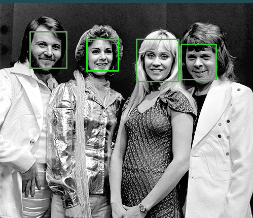  
*Figure 1 - Image de test `ABBA.png` et le résultat obtenu*

Sur cette image, le programme fonctionne parfaitement, il détecte bien 4 visages et renvoie bien dans le terminal 'Found 4 faces!'. 

Pour la prochaine image, j'ai choisi une image montrant un même visage sous plusieurs angles, il s'agit, ici, de montrer les limites du programme en ce qui concerne les visages plus ou moins de profil.  

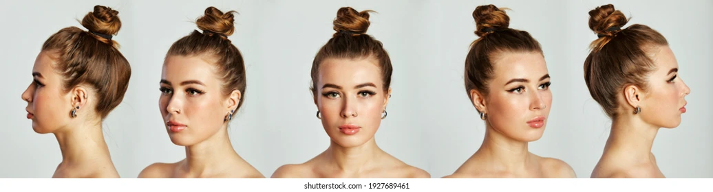 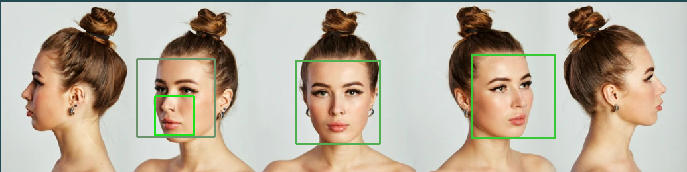   
*Figure 2 - Image de test `image_diff_angles.png` et le resultat obtenu*

Avec cette image, on prend déjà conscience de la limite du programme car celui-ci détecte bien les 3 visages centraux mais il ne détecte pas lorsque le visage est totalement de profil. De plus, pour le 2ème visage en partant de la gauche, il détecte un autre visage comprenant seulement le menton, la bouche et le nez. 

L'image suivante est une photo en plongée, on reste toujours dans l'objectif de prendre une image d'un visage d'un point de vue différent. 

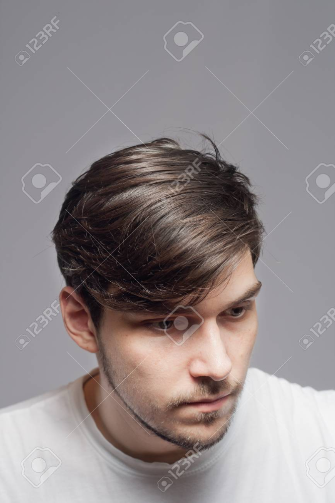   
*Figure 3 - Image de test `image_plongee.png` et le résultat obtenu*  

Pour l'image vue en plongée, aucun visage n'est détecté, on en déduit énormement d'information concernant les différents points de vue détecté par le programme. En effet, celui-ci à l'air de très bien fonctionner lorsqu'un visage se trouve face à la caméra, en revanche dès qu'on change l'angle de vue, le programme n'est plus si efficace. 

Ensuite, une image en contre‑plongée permet d'analyser l'effet de la perspective, d'après les résultats précédents, on ne s'attend pas forcément à la détection d'un visage sous cet angle ci.

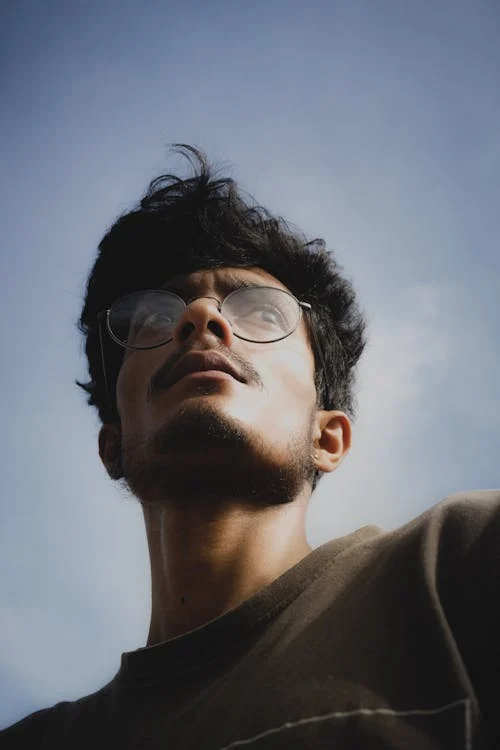 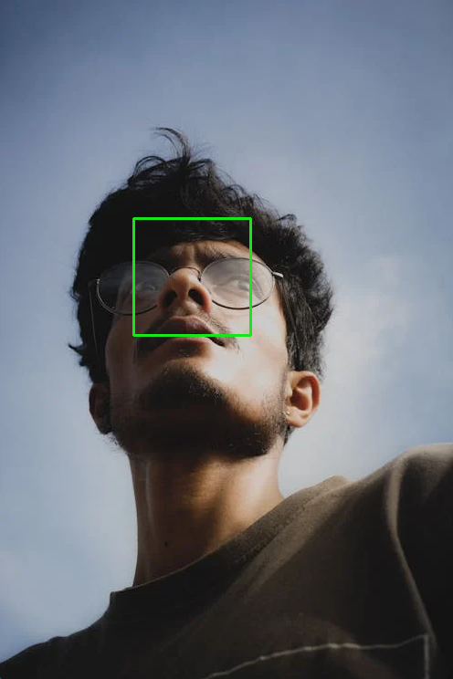  
*Figure 4 - Image de test `image_contre_plongee.png` et le résultat obtenu*

Le programme détecte un visage sur la photo, malheureusement ce n'est pas vraiment le visage en entier, il détecte seulement une petite partie au centre du visage comprenant le nez les yeux et une partie de la bouche. Donc la détection n'est pas totalement valider. 


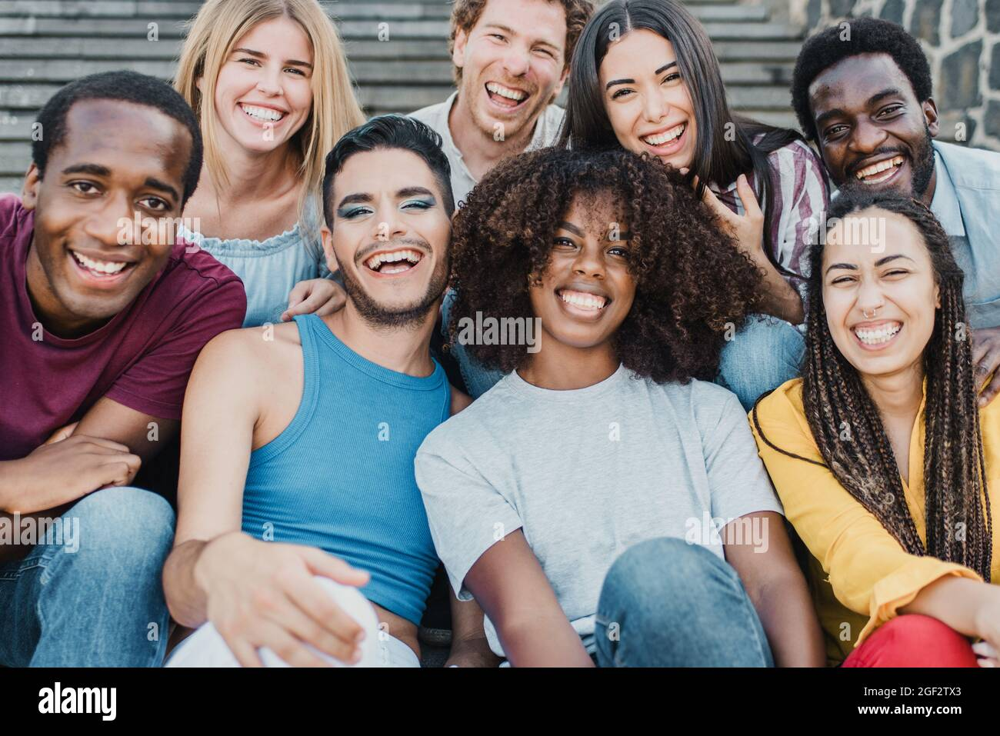 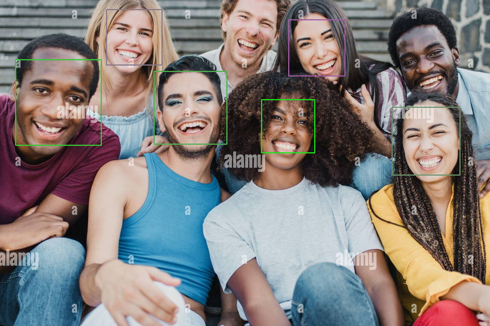  
*Figure 5 - Image de test `image_groupe.png` et le résultat obtenu*

Sur cette image, le programme détecte seulement certaines personnes, les photos de groupe, tout comme les photos d'une personne seule ne fonctionne seulement sous certains angles de la tête. Le nombre de personne n'a pas l'air de déranger. 


Pour des images plus ou moins lumineuse, j'ai testé sur une image avec un faible éclairage , le programme détecte bien le visage car les particularités faciales sont toujours très bien reconnaissables (voir figure 6).  

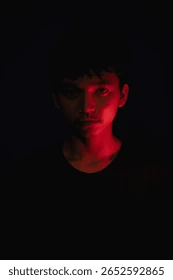 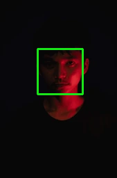  
*Figure 6 - Image de test `image_faible_eclairage.png` et le résultat obtenu*

J'ai également testé sur une image avec une personne à contre-jour et le programme ne détecte pas de visage (les images sont disponibles dans le dossier photos). 

Un visage de robotpar est très bien reconnu par le programme, ce qui est compréhensible vu que le visage du robot à les même caractéristique que celui d'un humain. De plus le programme détecte aussi le visage d'un robot au deuxième plan (voir figure 7 ci-dessous). 

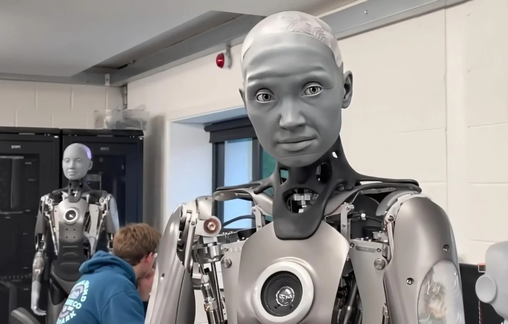 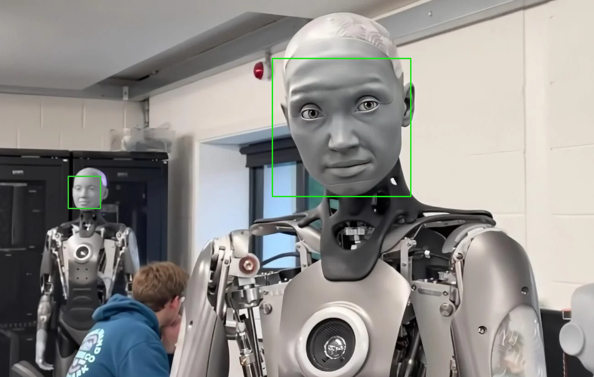  
*Figure 7 - Image de test `image_visage_robot.png` et le résultat obtenu*

De la même manière, le programme a très bien détecté le visage d'une statue (voir photos dans le dossier photos).  

pour passer sur des images moins facile, j'ai pris des peintures et des dessins et le programme ne détecte pas de visage sur les 2 peintures que j'ai choisi ni sur les 2 dessins (voir les photos dans le dossier photo`). 


Comme dernière image de test j'ai pensé à prendre un cas de pareidolie (objet évoquant un visage) pour voir à quel point la méthode des cascades de Haar peuvent être trompées. Et comme on peut le voir sur l'image ci-dessous, le programme détecte un visage sur une prise, on en dééduit donc qu'il ne faut pas grand chose pour que le programme détecte un visage.   

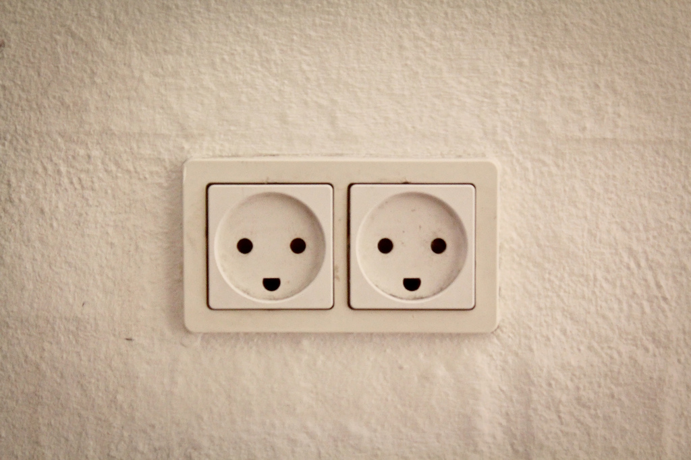 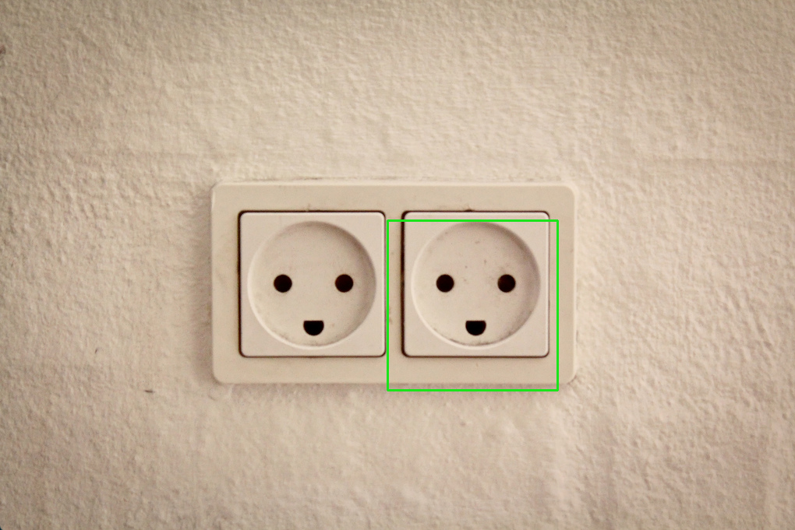  
*Figure 8 - Image de test `image_pareidolie.png` et le résultat obtenu*

Toutes les photos précédentes ont étés traitées par le programme avec les paramètres suivant : 
```
scaleFactor=1.1,
minNeighbors=5,
minSize=(30, 30),
```

Maintenant, on va faire varier ces paramètres sur l'image de la figure 2. J'ai choisi cette image pour avoir des éléments de comparaison quant à l'angle du visage. 

Pour commencer nous allons commencer par faire varier `scaleFactor`. Je l'ai testé pour les valeurs : 1.02, 1.06, 1.1, 1.15, 1.20, 1.25 et 1.30. Les figures ci-dessous sont les images pour scaleFactor égal à 1.02 et 1.3 : 

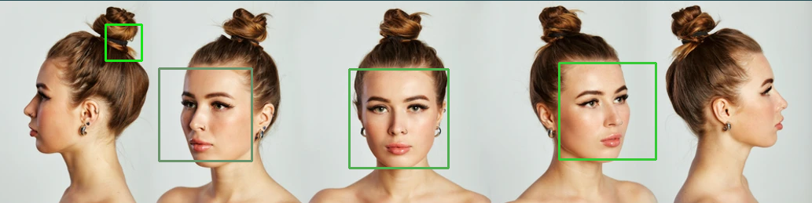   
*Figure 9 - Image de test en faisant varier scaleFactor*

En jouant sur le scaleFactor, on constate que le rapprocher de 1 (par exemple 1.05) rend la recherche plus fine : l’algorithme passe davantage d’échelles intermédiaires et parvient à conserver un visage partiel ou très légèrement tourné qui disparaît aux valeurs plus grossières. Cette finesse a un coût : le temps de traitement augmente sensiblement et on voit apparaître une ou deux détections parasites (zones centrées autour d’un nez ou d’une bouche). À 1.10, l’équilibre reste correct : la plupart des visages clairement frontaux sont bien détectés sans surcharge excessive. Lorsque l’on pousse le scaleFactor à 1.20 puis 1.30, la vitesse gagne visiblement (moins de niveaux explorés), mais un visage un peu excentré ou plus incliné n’est plus retenu. En clair, la progression est monotone : plus on augmente ce facteur, plus on perd de la sensibilité sur les poses ambiguës. La valeur 1.10 reste un compromis pertinent ; 1.05 ne devient justifiable que si l’on accepte une pénalité temporelle pour maximiser le rappel.

Faisons maintenant varier la variable minNeighbors :

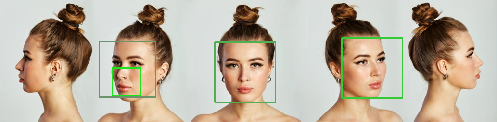 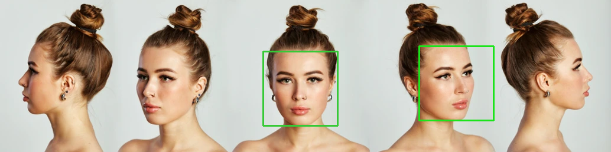  
*Figure 10 - Image de test en faisant varier minNeighbors*

La variation de minNeighbors agit comme un filtre de consolidation. À une valeur basse (3), la cascade accepte volontiers des regroupements faibles : on récupère parfois un cadre supplémentaire partiel (menton + bouche) qui n’apparaissait pas autrement. En revanche cette “générosité” augmente les faux positifs mineurs. Revenir à 5 stabilise l’ensemble : les cadres parasites disparaissent et les visages principaux demeurent. En poussant à 8, on perd déjà un visage limite (profil doux ou visage plus petit). À 10, ne subsistent que les plus nets. Cette évolution confirme l’intuition : minNeighbors agit comme un curseur précision contre rappel. La valeur 5 constitue un centre de gravité ; 3 est utile si l’on veut “ratisser large” (quitte à nettoyer ensuite) ; 8 ou plus deviennent intéressants uniquement si l’on privilégie la propreté visuelle au détriment de cas limites.

Et enfin, faisons varier minSize :

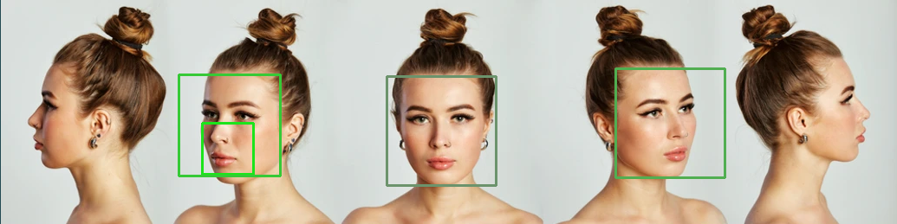 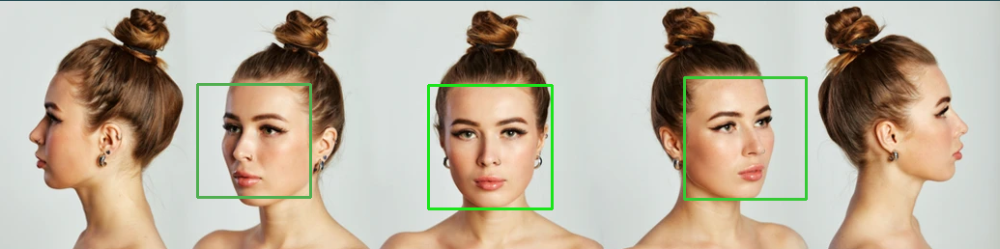  
*Figure 11 - Image de test en faisant varier minSize*

Modifier minSize revient à décider à partir de quelle taille un visage mérite d’être considéré. Abaisser ce seuil (20×20) n’a pas vraiment apporté de nouveaux visages sur cette image précise ; cela introduit surtout quelques amorces de cadres partiels mal centrés. Laisser 30×30 maintient un bon rapport entre bruit et richesse. En augmentant à 60×60, un visage plus étroit disparaît déjà. À 80×80, il ne reste que les visages les plus imposants, l’image donnant la fausse impression que la scène contient moins de personnes. Ce paramètre agit donc davantage comme un coupe‑bruit grossier qu’un levier fin : passé un certain point, il “assainit” visuellement mais fausse la réalité en masquant des visages légitimes.


## 2. Traitement en temps réel, mise en œuvre de la webcam sous OpenCV

### 2.1 Objectif
Passer des images fixes au flux vidéo afin d’observer la stabilité de la détection (latence, régularité, faux positifs) dans des conditions ordinaires (bureau, plusieurs personnes, éclairage variable). J’ajoute aussi une brique optionnelle de « reconnaissance » (identifier une personne connue) pour clarifier la différence détection vs identification.

### 2.2 Code de base utilisé
Le script `face_detection/face_detector.py` :
- ouvre la webcam (`cv2.VideoCapture(0)`),  
- convertit chaque frame en niveaux de gris,  
- applique la cascade `haarcascade_frontalface_default.xml`,  
- dessine un rectangle autour de chaque visage,  
- affiche le flux jusqu’à pression de `q`.

Extrait du code :
```python
face_cascade = cv2.CascadeClassifier(
    cv2.data.haarcascades + "haarcascade_frontalface_default.xml"
)
cap = cv2.VideoCapture(0)

while True:
    ret, frame = cap.read()
    if not ret:
        break
    gray = cv2.cvtColor(frame, cv2.COLOR_BGR2GRAY)
    faces = face_cascade.detectMultiScale(gray, scaleFactor=1.1, minNeighbors=5)
    for (x, y, w, h) in faces:
        cv2.rectangle(frame, (x, y), (x + w, y + h), (255, 0, 0), 2)
    cv2.imshow("Visages détectés", frame)
    if cv2.waitKey(1) & 0xFF == ord('q'):
        break
cap.release()
cv2.destroyAllWindows()
```

### 2.3 Améliorations / pistes
Mises en place (ou préparées) :
- Vérification `cap.isOpened()` et `face_cascade.empty()`.
- Paramétrage résolution (`cap.set(3, 640)` / `cap.set(4, 480)`) pour stabiliser le FPS.
- Calcul optionnel du FPS moyen (chrono sur N frames).
- Exposition des paramètres (`scaleFactor`, `minNeighbors`) via arguments possibles (amélioration future CLI).
- Sauvegarde des visages (section 2.4).
- Filtrage simple sur la taille du rectangle pour éviter le bruit.

### 2.4 Sauvegarde automatique des visages
Objectif : constituer un mini jeu de données au fil du flux pour analyse ou pour une étape de reconnaissance.

Convention de nommage : `YYYY-MM-DD_HH-MM-SS_index.jpg` dans un dossier `visages/`.

Bloc d’exemple :
```python
import os
from datetime import datetime

os.makedirs("visages", exist_ok=True)

faces = face_cascade.detectMultiScale(
    gray,
    scaleFactor=1.1,
    minNeighbors=5,
    minSize=(30, 30)
)
timestamp = datetime.now().strftime("%Y-%m-%d_%H-%M-%S")
for i, (x, y, w, h) in enumerate(faces, start=1):
    if w < 40 or h < 40:  # filtre taille minimale
        continue
    crop = frame[y:y+h, x:x+w]
    filename = f"visages/{timestamp}_{i}.jpg"
    cv2.imwrite(filename, crop)
```

Optionnel : ne sauvegarder qu’une frame sur N pour limiter le volume.

### 2.5 Tests effectués (détection temps réel)
Scénarios (paramètres par défaut sauf mention) :
1. Éclairage standard (bureau) : détection stable, aucun faux positif observé.  
2. Lumière diminuée : intermittences (visage parfois manqué quand contraste chute).  
3. Deux personnes : rectangles distincts, stabilité correcte.  
4. Mouvement rapide de la tête : « clignotements » ponctuels (perte 1–2 frames).  
5. Masque chirurgical : détection conserve la fenêtre (œil–front suffisants).  
6. Lunettes foncées opaques : légère latence d’apparition sur certaines poses.  
7. Accessoire couvrant (casque) : dépend surtout de la visibilité des orbites et du contraste global.  
8. Arrière‑plan chargé (textures, affiches) : pas de faux positifs sur ce jeu restreint.  


### 2.6 Limites observées
- Profils prononcés (> ~60°) non détectés ou perdus rapidement.
- Faible éclairage : bruit + aplatissement des gradients → baisse marquée du rappel.
- Flou de mouvement : disparition temporaire (features locales non stables d’une frame à l’autre).
- Occlusions fortes (main couvrant moitié visage) : segmentation manquante ou rectangle décalé.
- Variabilité accessoires : lunettes opaques + faible lumière cumulées aggravent les manques.

### 2.7 (Optionnel) Ébauche de reconnaissance
Distinction rappelée :
- Détection : trouver « où » se situe un visage.
- Reconnaissance : associer ce visage à une identité connue.

Approche exploratoire possible :
1. Collecter plusieurs crops par personne (dossier par identité ou labels numériques).
2. Conversion en niveaux de gris + redimension (ex. 100×100).
3. Entraînement d’un modèle LBPH (`cv2.face.LBPHFaceRecognizer_create()`) — nécessite `opencv-contrib-python`.
4. Prédiction pour chaque visage détecté avec score (distance).  
5. Seuil de rejet pour éviter fausses attributions.

Limites : dataset réduit → sur‑ajustement et sensibilité forte à l’éclairage / pose. Sans normalisation géométrique (alignement yeux) la variabilité intra‑classe reste élevée.

Implémentation : [detector.py](./face_recognizer/detector.py)

Résultat de la reconnaissance faciale : 

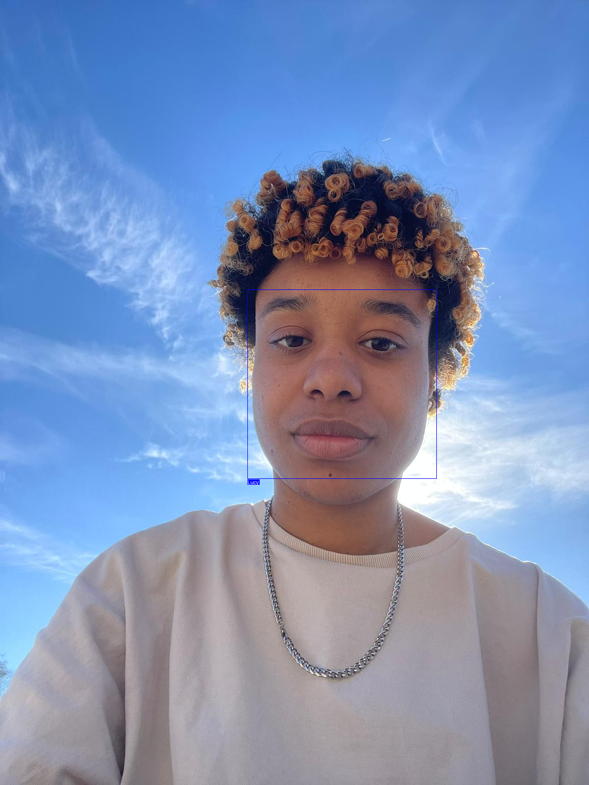

Sur cette photo c'est moi et je suis reconnue grace au training effectué dans le script à l'aide des dossiers avec des photos des personnes que l'on souhaite reconnaitre.

### 2.8 Mise en perspective
Les cascades restent utiles pour : prototypes rapides, environnements sans accélération matérielle, filtrage initial avant un traitement plus coûteux. Cependant, pour une application robuste (poses variées, occlusions, faible lumière), des détecteurs modernes (RetinaFace, YOLO‑Face, modèles ONNX légers) surpassent largement cette approche en rappel et précision, tout en fournissant souvent une estimation de landmarks.

### 2.9 Synthèse
En flux temps réel, la cascade fonctionne correctement sur des visages frontaux bien éclairés et relativement statiques. Les pertes surviennent principalement avec angle marqué, éclairage défavorable ou mouvement rapide. La sauvegarde automatique des crops fournit une base exploitable pour expérimenter une reconnaissance simple, mais met rapidement en évidence les limites structurelles de l’approche (invariance restreinte et dépendance forte au contraste). Cela confirme le caractère surtout pédagogique de la méthode dans ce contexte.

