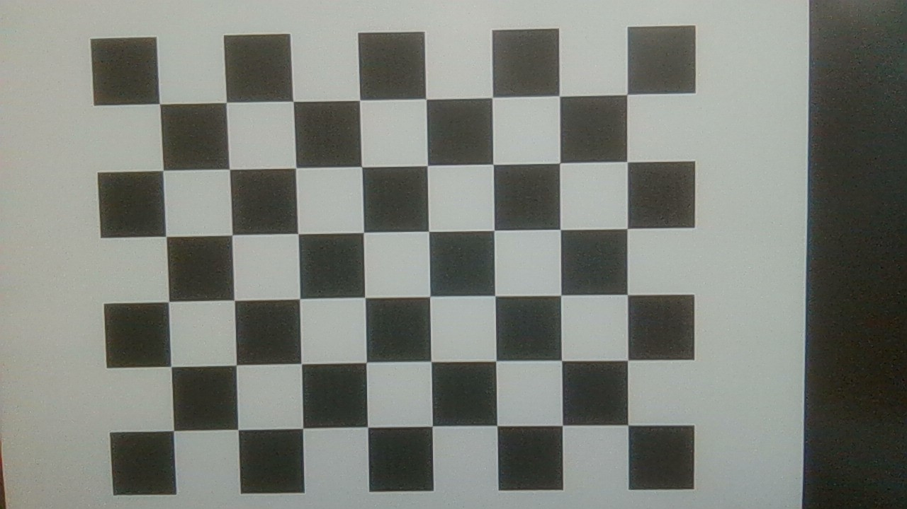
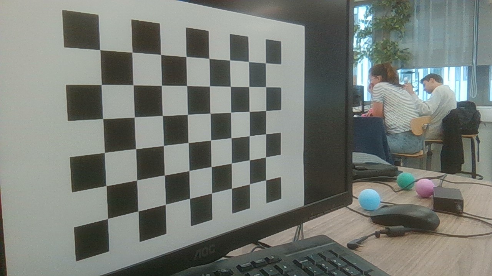
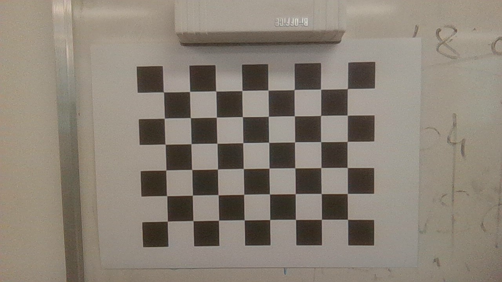
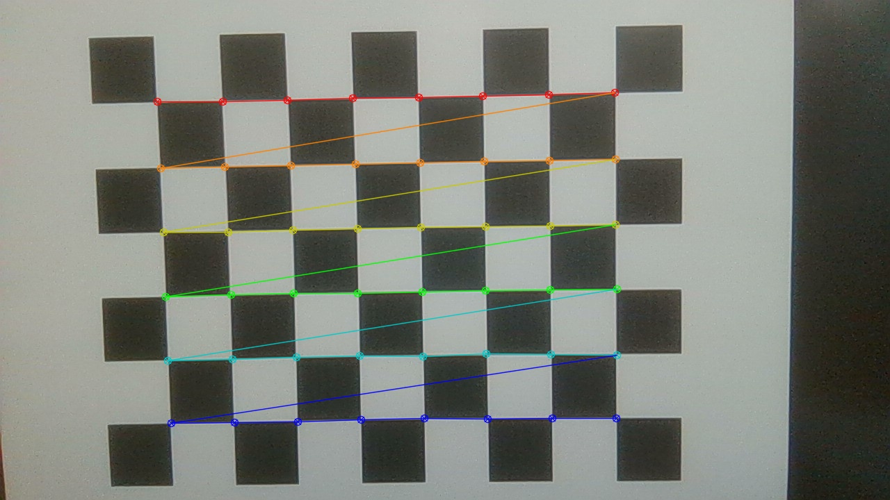
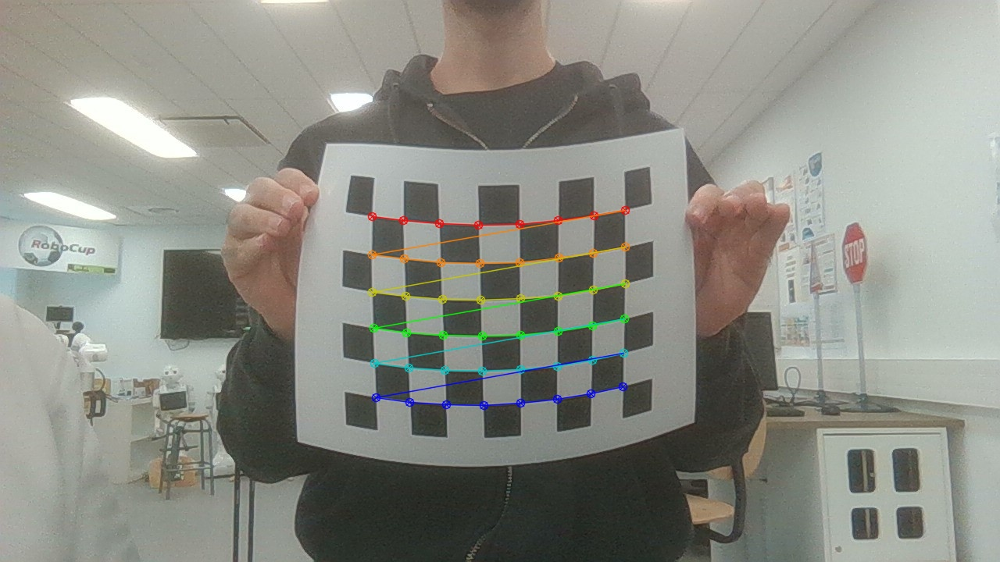
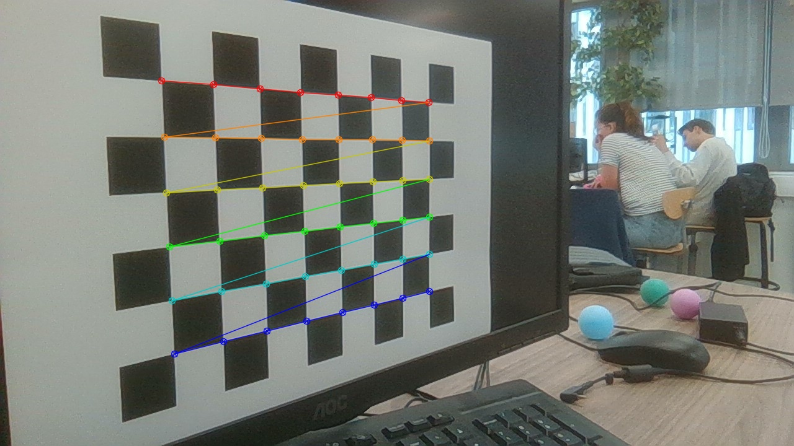
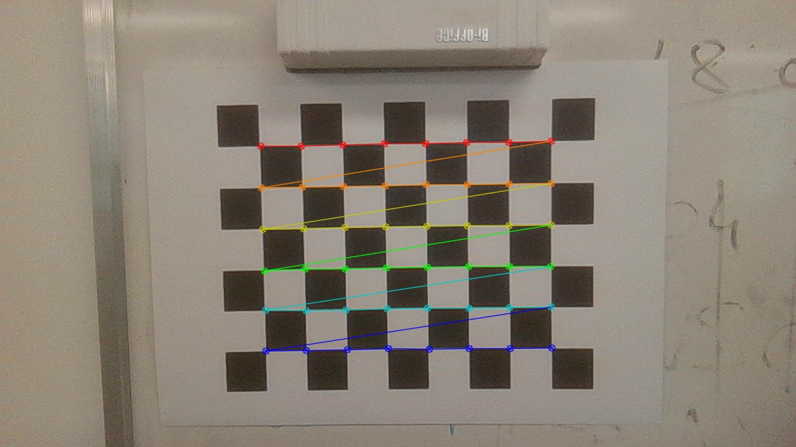
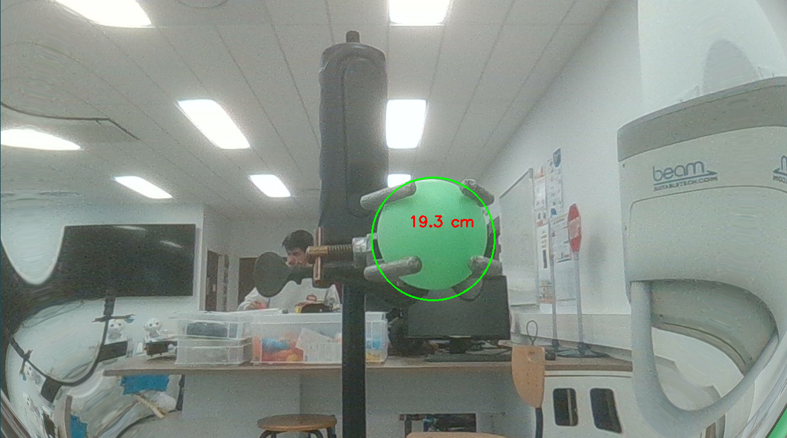

# Couleur

**Auteure** : Lucy SAINT-AURET  
**Date de début** : 24/09/2025  
**Date de fin** : 03/10/2025  
**Professeur encadrant** : Fabrice JUMEL  
**École** : CPE Lyon  
**Module** : Vision  
**Outils / Langage** : Python 3.11.9, OpenCV 4.9

## Sommaire

- [Couleur](#couleur)
  - [Sommaire](#sommaire)
  - [Introduction](#introduction)
  - [Objectifs du TP](#objectifs-du-tp)
  - [Fichiers et documents fournis](#fichiers-et-documents-fournis)
  - [Code de base (suivi d’une balle verte)](#code-de-base-suivi-dune-balle-verte)
  - [Multi‑couleurs et choix d’un objet pertinent](#multicouleurs-et-choix-dun-objet-pertinent)
  - [Intégration contrôle (agent autopilot)](#intégration-contrôle-agent-autopilot)
  - [Plusieurs objets d’une même couleur / comportement drone](#plusieurs-objets-dune-même-couleur--comportement-drone)
  - [Suivi d'une balle](#suivi-dune-balle)
  - [Passage webcam + autre couleur](#passage-webcam--autre-couleur)
  - [Problème d’identité (sauts entre balles)](#problème-didentité-sauts-entre-balles)
  - [Maintien d’identité (solution)](#maintien-didentité-solution)
  - [Apprentissage interactif d’une couleur](#apprentissage-interactif-dune-couleur)
  - [Estimation distance par interpolation inverse](#estimation-distance-par-interpolation-inverse)
  - [Calibration caméra et distance géométrique](#calibration-caméra-et-distance-géométrique)

## Introduction 
Ce deuxième TP se concentre sur la détection et le suivi d’objets colorés (ici des balles) dans des flux vidéo (fichiers ou webcam) et sur la manière de transformer cette information visuelle en commandes de pilotage (concept drone). La couleur fournit une piste simple et rapide pour localiser un objet sans recourir à des méthodes lourdes d’apprentissage profond. On explore progressivement : filtrage par couleur en HSV, sélection robuste du bon objet quand plusieurs candidats sont présents, maintien d’identité entre frames, apprentissage interactif d’une nouvelle couleur, estimation de distance par relation empirique puis par calibration intrinsèque de caméra. L’ensemble forme un fil conducteur : aller d’un simple masque de couleur jusqu’à une boucle perception → décision (PID ou logique de contrôle) exploitable pour un scénario de poursuite.

## Objectifs du TP 

1. Prendre en main un pipeline de segmentation couleur simple (BGR → HSV → seuillage → extraction de moments / contours).
2. Étendre ce pipeline à plusieurs couleurs paramétrables sans dupliquer du code inutilement.
3. Mettre en évidence les limites d’une stratégie naïve (sélection « plus grande zone » → sauts entre objets) et proposer une stratégie de continuité spatiale.
4. Introduire une logique de contrôle (concept PID) couplée à la localisation de l’objet.
5. Implémenter un apprentissage interactif de seuils de couleur (échantillonnage d’une ROI centrale + statistiques HSV).
6. Évaluer deux approches d’estimation de distance : interpolation empirique (diamètre apparent ↔ distance) puis modèle géométrique calibré.
7. Comprendre le rôle de la calibration caméra (matrice intrinsèque, distorsions) dans la fiabilité des mesures.

## Fichiers et documents fournis 

Principaux scripts (préfixés par la question) :
- `balls_tracker_question_1.py` : base – suivi d’une balle verte fixe en vidéo.
- `balls_tracker_question_2.py` : extension multi‑couleurs + filtrage contour/circularité.
- `autopilot_question_3.py` : intégration dans une boucle de commande (structure agent, PID simple).
- `track_question_4.py` : exemple externe pilotage drone multi formes, sélection plus grand contour.
- `balls_tracker_question_5.py` : suivi systématique de la balle la plus grande.
- `balls_tracker_question_6.py` : adaptation à la webcam + autre couleur (rose).
- `balls_tracker_question_9.py` : maintien d’identité (suivi de la même balle malgré concurrence).
- `balls_tracker_question_10.py` : apprentissage dynamique de la couleur.
- `graph_question_11.py` : calibration empirique distance ↔ pixels (modèle inverse).
- `balls_tracker_question_11.py` : variante intégrant apprentissage + suivi continu.
- `echiquier_question_12.py` : calibration intrinsèque + estimation de distance géométrique.

Ressources : vidéos (`ball.mp4`, `ball2.mp4`, `ball3.mp4`, `ball4.mp4`), photos d’echiquier (`Photos/Echiquier`), photos de la balle à distances connues.


## Code de base (suivi d’une balle verte)

Le code se trouve [ici](balls_tracker_question_1.py).

Le but du code est de suivre une balle de couleur verte en mettant un rond rouge en son centre. Sur tout le long de la vidéo, le but du code est de suivre la balle. 
Pour cela le script initial applique un flou gaussien (réduction bruit haute fréquence); une conversion HSV (séparation teinte / saturation / valeur), un `inRange` avec bornes vert (`[40,70,70]`–`[80,200,200]`),  un flou sur le masque, des moments pour obtenir le centroïde si aire non nulle, un dessin d’un cercle sur l’image d’origine puis affichage. 


## Multi‑couleurs et choix d’un objet pertinent

Le code se trouve [ici](balls_tracker_question_2.py).

  
Voici le résultat pour le suivi de la balle verte.

  
Voici le résultat pour le suivi de la balle jaune.

  
Voici le résultat pour le suivi de la balle rose.

  
Voici le résultat pour le suivi de la balle bleu.


Tout d'abord, j'ai ajouté un paramètre `couleur` (valeurs autorisées : bleu, rose, jaune, vert) avec des seuils HSV distincts.

Puis j'ai remarqué que ça ne fonctionnait pas pour les balles bleues car il y en avait 2, donc je suis partie sur une détection du contour. Une fois cela fait, j'ai pu suivre toutes les balles bleues mais un autre problème est survvenu, la détection à aussi pris les touches du clavier, en effet avec le reflet les touches du clavier étaient perçu comme étant bleues. Pour ne pas avoir une détection des touches du clavier, j'ai introduit un critère d'aire et de circularité. Après quelques configurations et tests pour avoir les bonnes valeurs pour une restriction parfaite. 


## Intégration contrôle (agent autopilot)

Le code se trouve [ici](autopilot_question_3.py).

Le fichier autopilot_question_3.py prend ce qu’on a déjà (le suivi couleur qui donne un centre de balle) et transforme ça en commandes pour le drone. L’idée : tant que la balle n’est pas au centre de l’image, on lui demande de se recentrer dessus (horizontal et vertical). C’est tout. On n’avance pas vers la balle, on ne tourne pas autour, on ne gère pas la distance réelle.  
La “distance” dans ce code n’est pas la distance physique. C’est juste un décalage dans l’image. Aucune utilisation de la taille de la balle (rayon), aucun calcul , aucun modèle. Si la balle est centrée mais loin, le drone ne bouge plus. Si elle grossit ou rapetisse, le code ignore complètement l’info.

## Plusieurs objets d’une même couleur / comportement drone

Le code se trouve [ici](track_question_4.py).

Si on met deux balles de la même couleur devant le drone avec le code de base, il n’y a aucune notion “d’identité”. Le tracker voit juste un masque couleur et en extrait un centroïde. Résultat concret :

soit il prend la première zone trouvée et ça peut changer d’une frame à l’autre selon le tri interne,
soit (si on modifie un peu) il choisit “la plus grosse” → ça marche tant que la même balle reste la plus grande, mais dès que l’autre se rapproche de la caméra et devient visuellement plus grande, le code “saute” dessus.
Dans les deux cas : le drone change brutalement de cible. Donc trajectoire qui zigzague, commandes incohérentes (alternance gauche/droite), et surtout comportement instable si l’objectif réel est “reste toujours derrière la même balle”.

Ce comportment n'est pas pertinent car un vrai suivi doit maintenir une continuité temporelle; le critère “plus grande aire” n’est pas fiable (proximité, perspective, occlusion temporaire faussent la taille apparente); sans mémoire, on ne peut pas implémenter de logique de poursuite.
En plus, si les deux balles passent près l’une de l’autre, ça peut créer des oscillations violentes (changement de direction à chaque frame).

Le code “track.py” (lien donné) propose une idée pour stabiliser un peu, il segmentate la couleur et nettoie morphologiquement, il récupère tous les contours, il filtre par aire minimale pour ignorer les petits blobs parasites, il sélectionne explicitement du contour “dominant” (souvent le plus grand) ou éventuellement usage du rectangle englobant/minAreaRect pour avoir un angle et une taille plus stables. A partir de là, il calcul le centre et génère l’ordres.

Ce que ça résout partiellement : éviter de prendre une poussière ou un reflet minuscule.
Ce que ça ne résout pas totalement : la perte d’identité quand deux objets comparables alternent.
Souvent dans ce genre de scripts on ajoute un petit “inertial lock” implicite : tant que la différence d’aire entre la cible courante et une autre n’excède pas un certain pourcentage, on garde l’ancienne. Si le code que tu as consulté semble “tenir” sur une balle, c’est généralement parce que l’autre ne devient pas assez grande pour faire basculer la sélection, ou qu’il existe un tri stable + un ordre de parcours constant.

## Suivi d'une balle

Le code se trouve [ici](balls_tracker_question_5.py).

  
Voici le résultat pour le suivi de la balle verte.

Avec ce programme, on track bien la balle verte et la peluche n'est pas pris en compte.

## Passage webcam + autre couleur

Le code se trouve [ici](balls_tracker_question_6.py).

  
Voici le résultat pour le suivi de la balle verte.

Ici j’ai repris le code précédent (question 5) mais au lieu de lire une vidéo, je passe sur la webcam (VideoCapture(0)). Le but : vérifier que le pipeline couleur + sélection de la plus grosse balle reste valable en conditions “réelles” (éclairage variable, reflets, bruit) et pour les balles de couleur rose. 

`balls_tracker_question_6.py` reprend la logique de la question 5 mais remplace la source vidéo par `VideoCapture(0)` pour pouvoir utiliser la webcam. J’appelle track(image, "rose") pour utiliser les seuils HSV associés à la couleur rose ([160, 80, 80] → [179, 255, 255] dans mon code).

j'observe que le code fonctionne parfaitement, on suit bien la plus grosse balle affichée à l'écran. 

## Problème d’identité (sauts entre balles)

Le problème est visible sur la vidéo de la partie précédente. On track la plus grosse balle sur l'écran, on ne track pas une balle tout court. Or, on aimerait pouvoir suivre une balle et ne pas perdre le focus dès qu'une balle plus grosse apparait. 

L’algorithme « plus grande aire » génère des sauts de cible si une autre balle traverse le champ ou grossit (proximité cam). Cela nuit à un pilotage fluide (oscillations, divergence possible). Critère dimension unique insuffisant : la taille apparente peut fluctuer à cause de la perspective. 

## Maintien d’identité (solution)

Le code se trouve [ici](balls_tracker_question_9.py).

  
Voici le résultat pour le suivi d'une balle en ayant une autre plus grosse.

On veut corriger le défaut des versions précédentes où on “sautait” d’une balle à l’autre dès que l’aire changeait ou que l’autre passait plus près. Pour chacun des contours je calcule son cercle englobant puis j’obtiens le centre et le rayon que je stocke (centre, rayon, contour) dans une liste. Sur la première frame je prends la plus grosse balle à l'écran. Ça réutilise la logique des questions précédentes pour initialiser. A partir de la deuxième frame, au lieu de reprendre la plus grosse, je choisis celle dont le centre est le plus proche du centre précédent (last_center). La distance est comparée au carré (pas de sqrt pour rien).
Je dessine uniquement cette cible (cercle + point central) et je mets à jour last_center seulement si la détection est réelle (pas (-1,-1)).

## Apprentissage interactif d’une couleur

Le code se trouve [ici](balls_tracker_question_10.py).

  
  
  
   

Voici les résultats pour l'apprentissage de la couleur d'une balle.

L’objectif de cette étape est de supprimer la dépendance à des seuils HSV fixés manuellement et de permettre l’adaptation rapide à un nouvel objet coloré. Le principe retenu est un apprentissage : l’utilisateur place l’objet cible (balle) au centre du champ de la caméra, puis déclenche la capture (touche ESPACE). Le script extrait alors une petite région carrée (20×20 pixels) centrée dans l’image, convertit cette zone en espace HSV et calcule pour chacun des trois canaux la moyenne et l’écart‑type.

Les seuils utilisés pour la segmentation sont construits automatiquement sous la forme :
borne basse = moyenne − k × écart‑type ; borne haute = moyenne + k × écart‑type, avec k = 1.5 dans cette version. Les valeurs sont tronquées pour rester dans les domaines valides (H ∈ [0,179], S,V ∈ [0,255]). Ce choix (moyenne ± kσ) procure un compromis simple entre sélectivité et tolérance intra‑objet. Une fois ces bornes définies, le pipeline de suivi redevient classique : flou gaussien, conversion HSV, seuillage via cv2.inRange, extraction des contours, filtrage par aire, puis sélection de l’objet à suivre. La sélection temporelle repose sur le mécanisme introduit précédemment (maintien d’identité par proximité du centre précédent), ce qui évite les changements intempestifs lorsque plusieurs objets de couleur similaire entrent dans le champ.

Le comportement observé est satisfaisant dès lors que la région d’apprentissage est propre. L’approche est sensible à deux facteurs : un cadrage imprécis ou un fond partiellement similaire peut élargir abusivement les seuils et des variations d’éclairage importantes après l’apprentissage peuvent dégrader la segmentation, puisqu’il n’y a pas d’adaptation dynamique. Malgré cela, pour un environnement raisonnablement stable, le suivi est immédiatement opérationnel sans retouche des paramètres.


## Estimation distance par interpolation inverse

Le code se trouve [ici](graph_question_11.py).

  
Voici le résultat pour l'apprentissage de la couleur d'une balle.

Ici je voulais obtenir une estimation rapide de la distance entre la caméra et la balle sans encore passer par la calibration intrinsèque. L’idée est simple : plus la balle est proche, plus son diamètre apparent (en pixels) grandit.

Concrètement, j’ai pris plusieurs images de la balle posée à des distances mesurées (exemple : 13 cm, 20 cm, 37 cm, 70 cm, 85 cm). Pour chacune, je détecte la balle en HSV (seuillage vert, bornes que j’ai ajustées pour mon exemplaire). Je récupère le plus grand contour et j’en extrais le cercle englobant : diamètre en pixels. Plutôt que de lancer une régression directe distance = a * diamètre + b (qui n’est pas linéaire dans la vraie perspective), j’utilise le fait que dans un modèle de projection pinhole idéal on a quelque chose de l’ordre distance ≈ (constante) / diamètre. J’adopte donc un modèle de la forme distance ≈ α / d_px + β. J’empile les termes dans un système linéaire (1/d_px et 1) et je résous par moindres carrés (numpy lstsq). Ça me donne α et β (imprimés dans le script), puis je trace le nuage de points distance vs diamètre et la courbe ajustée α/x + β pour vérifier visuellement que ça suit bien. Sur un jeu de données propre (balle bien centrée, pas de déformation extrême), la tendance colle.

Ensuite je teste sur une photo “inconnue” (par exemple photo100.jpg) : je refais exactement la même détection, récupère le diamètre apparent, applique distance = α / d_px + β, et j’affiche la valeur estimée en centimètres. Ça donne une estimation rapide qui suffit à valider le principe avant de passer à la calibration de la question 12.

Les points à surveiller : si une des images de calibration a une erreur (mauvais seuil HSV, bord coupé, ellipse déformée), le diamètre mesuré est faux et ça perturbe l’ajustement (les extrêmes, proche ou loin, ont beaucoup d’influence). On pourrait nettoyer en éliminant des points aberrants ou en pondérant. L’approximation α / d_px + β résume en fait (f * D_réel)/d_px avec un léger décalage absorbé par β, mais comme je n’ai pas encore la focale ni corrigé la distorsion, c’est une “boîte noire” pratique. C’est une interpolation, pas un modèle physique pur : si je sors de l’intervalle couvert (par exemple tester à 5 cm ou 2 m alors que j’ai calibré entre 13 et 85 cm), ça se dégrade.

Ce que j’obtiens : une relation exploitable immédiatement pour donner un retour de distance approximatif dans une boucle de suivi (par exemple décider d’avancer si distance estimée > seuil). Limitation évidente : dépend de la taille réelle de la balle (supposée constante et connue implicitement), dépend du fait que la balle est bien frontale et non écrasée par une perspective oblique, dépend aussi du fait que la segmentation HSV capture bien l’objet entier (sinon contour tronqué → diamètre sous-estimé → distance surestimée).

## Calibration caméra et distance géométrique

Le code se trouve [ici](echiquier_question_12.py).

`echiquier_question_12.py` réalise la calibration complète de la caméra et remplace l’approche empirique de la question 11 par un modèle géométrique. L’objectif : corriger la distorsion optique et obtenir une relation fiable entre taille apparente et distance réelle.

Je pars d’un damier (pattern 8×6 coins intérieurs). Pour chaque image je détecte les coins (`cv2.findChessboardCorners`), j'associe les points 3D aux points 2D, je les accumule dans deux listes. Quand j’ai assez de poses variées (inclinaisons, translations, damier déplacé dans les coins), j’appelle `cv2.calibrateCamera` qui renvoie :
- la matrice intrinsèque

$$
K = \begin{bmatrix} f_x & 0 & c_x \\ 0 & f_y & c_y \\ 0 & 0 & 1 \end{bmatrix}
$$

- les coefficients de distorsion (radiale $k_1,k_2,k_3$ et tangentielles $p_1,p_2$).

Sans correction de distorsion, les tailles mesurées vers la périphérie sont faussées. J’utilise donc :

$$I_{undist} = \text{undistort}(I, K, dist)$$

Une fois l’image corrigée, je masque la balle (HSV vert) et j’extrais le diamètre en pixels $d_{px}$ via le cercle englobant. Le modèle pinhole donne :

$$ d_{px} \approx \frac{f \cdot D_{réel}}{Z} \;\; \Rightarrow \;\; Z \approx \frac{f \cdot D_{réel}}{d_{px}} $$

avec $f = \tfrac{f_x + f_y}{2}$ (moyenne acceptable), $D_{réel}$ le diamètre physique (4.0 cm), $Z$ la distance estimée.

Images d’échiquier utilisées (version brute AVANT détection des coins — les images annotées après détection sont produites automatiquement dans `output_corners/`) :

     

J’annote ensuite l’image : cercle + texte $Z$ (cm). 

Extrait du script :
```python
(fx, fy) = (mtx[0,0], mtx[1,1])
f = (fx + fy) / 2
Z = (f * real_diameter_cm) / d_px
```

Comparaison avec l’interpolation inverse (Q11) : celle-ci ajustait $\text{distance} = \alpha / d_{px} + \beta$. Ici, $\beta$ disparaît si la calibration est correcte (modèle physique pur). L’approche calibrée tient mieux hors plage (extrapolation) et généralise à d’autres objets de dimensions connues. 

Illustrations quelques vues damier utilisées (après détection des coins) :

     

Matrice intrinsèque (exemple) affichée par le script :
```
[[f_x    0    c_x]
 [ 0    f_y   c_y]
 [ 0     0     1]]
```

Points de vigilance : diversité des poses (sinon focale instable), contraste suffisant pour extraire tous les coins, cohérence d’échelle (cases supposées carrées). Un échantillonnage trop central peut sous‑contraindre la distorsion radiale. 

Pour une balle se situant à 20 cm, voici le résultat : 

Résultat dans le terminal : 
```
[OK] Coins détectés sur photo_echiquier.jpg, sauvegardé dans output_corners\corners_photo_echiquier.jpg
[OK] Coins détectés sur photo_echiquier0.jpg, sauvegardé dans output_corners\corners_photo_echiquier0.jpg
[OK] Coins détectés sur photo_echiquier1.jpg, sauvegardé dans output_corners\corners_photo_echiquier1.jpg
[OK] Coins détectés sur photo_echiquier10.jpg, sauvegardé dans output_corners\corners_photo_echiquier10.jpg
[OK] Coins détectés sur photo_echiquier11.jpg, sauvegardé dans output_corners\corners_photo_echiquier11.jpg
[OK] Coins détectés sur photo_echiquier12.jpg, sauvegardé dans output_corners\corners_photo_echiquier12.jpg
[OK] Coins détectés sur photo_echiquier14.jpg, sauvegardé dans output_corners\corners_photo_echiquier14.jpg
[OK] Coins détectés sur photo_echiquier15.jpg, sauvegardé dans output_corners\corners_photo_echiquier15.jpg
[OK] Coins détectés sur photo_echiquier16.jpg, sauvegardé dans output_corners\corners_photo_echiquier16.jpg
[OK] Coins détectés sur photo_echiquier2.jpg, sauvegardé dans output_corners\corners_photo_echiquier2.jpg
[OK] Coins détectés sur photo_echiquier3.jpg, sauvegardé dans output_corners\corners_photo_echiquier3.jpg
[OK] Coins détectés sur photo_echiquier4.jpg, sauvegardé dans output_corners\corners_photo_echiquier4.jpg
[OK] Coins détectés sur photo_echiquier5.jpg, sauvegardé dans output_corners\corners_photo_echiquier5.jpg
[OK] Coins détectés sur photo_echiquier6.jpg, sauvegardé dans output_corners\corners_photo_echiquier6.jpg
[OK] Coins détectés sur photo_echiquier7.jpg, sauvegardé dans output_corners\corners_photo_echiquier7.jpg
[OK] Coins détectés sur photo_echiquier8.jpg, sauvegardé dans output_corners\corners_photo_echiquier8.jpg

Matrice intrinsèque :
 [[972.95727463   0.         628.75782318]
 [  0.         979.3540292  306.57817228]
 [  0.           0.           1.        ]]
Coefficients de distorsion :
 [[-4.15242699e-01  3.78922417e+00 -7.68848702e-03 -4.63072201e-03
  -9.05302263e+00]]
Diamètre: 201.8px -> Distance estimée: 19.3 cm
```

  

