# Détection et Localisation de Tags Visuels

**Auteure** : Lucy SAINT-AURET  
**Date** : 03/10/2025  
**Professeur encadrant** : Fabrice JUMEL  
**École** : CPE Lyon  
**Module** : Vision  
**Outils / Langage** : Python 3.11.9, OpenCV 4.9, pyzbar, qrcode

## Sommaire 

- [Détection et Localisation de Tags Visuels](#détection-et-localisation-de-tags-visuels)
  - [Sommaire](#sommaire)
  - [Introduction](#introduction)
  - [Objectifs](#objectifs)
  - [Technologies et bibliothèques utilisées](#technologies-et-bibliothèques-utilisées)
  - [Description des fichiers Python](#description-des-fichiers-python)
    - [qr\_tracker\_basic.py](#qr_tracker_basicpy)
    - [aruco\_tracker\_advanced.py](#aruco_tracker_advancedpy)
    - [multi\_tag\_tracker.py](#multi_tag_trackerpy)
    - [tag\_generator.py](#tag_generatorpy)
    - [tag\_distance\_estimation.py](#tag_distance_estimationpy)
  - [Installation et utilisation des programmes](#installation-et-utilisation-des-programmes)
    - [Installation préalable](#installation-préalable)
    - [Étape 1 : Génération des tags de test](#étape-1--génération-des-tags-de-test)
    - [Étape 2 : Test de détection basique des QR codes](#étape-2--test-de-détection-basique-des-qr-codes)
    - [Étape 3 : Test de détection avancée des marqueurs ArUco](#étape-3--test-de-détection-avancée-des-marqueurs-aruco)
    - [Étape 4 : Système unifié multi-tags](#étape-4--système-unifié-multi-tags)
    - [Étape 5 : Calibration de l'estimation de distance](#étape-5--calibration-de-lestimation-de-distance)
  - [Comparaison avec la détection par couleur](#comparaison-avec-la-détection-par-couleur)
  - [Fonctionnalités et algorithmes implémentés](#fonctionnalités-et-algorithmes-implémentés)
    - [Détection multi-tags](#détection-multi-tags)
    - [Stratégies de suivi adaptées](#stratégies-de-suivi-adaptées)
    - [Estimation de distance](#estimation-de-distance)
  - [Avantages des tags visuels](#avantages-des-tags-visuels)
    - [Robustesse et fiabilité](#robustesse-et-fiabilité)
    - [Richesse informationnelle](#richesse-informationnelle)
  - [Conclusion et perspectives](#conclusion-et-perspectives)
    - [Bilan du projet](#bilan-du-projet)
    - [Applications pratiques](#applications-pratiques)
    - [Limitations et améliorations futures](#limitations-et-améliorations-futures)

## Introduction

Ce travail pratique propose une approche alternative à la détection de balles de ping-pong en utilisant des tags visuels, notamment les QR codes et les marqueurs ArUco. Contrairement à la détection par couleur qui peut être sensible aux conditions d'éclairage et à la présence d'objets de couleurs similaires, les tags visuels offrent une solution plus robuste et informatrice pour la localisation d'objets.

Les tags visuels constituent des motifs géométriques spécialement conçus pour être facilement détectables par des algorithmes de vision par ordinateur. Ils permettent d'encoder des informations utiles, comme c'est le cas des QR codes, ou de servir de repères de référence pour la navigation et la localisation, à l'image des marqueurs ArUco.

## Objectifs

Ce projet vise à développer un système complet de détection et de suivi de tags visuels. Le système doit être capable de détecter simultanément différents types de tags (QR codes et marqueurs ArUco) tout en implémentant diverses stratégies de suivi adaptées des méthodes utilisées pour le suivi de balles.

L'estimation de distance constitue un aspect central du projet, exploitant les propriétés géométriques des tags pour obtenir une mesure plus précise que les méthodes traditionnelles basées sur la couleur. Le système doit également tirer parti des informations encodées dans les tags, comme les identifiants des marqueurs ArUco ou les données contenues dans les QR codes.

Une analyse comparative avec la détection par couleur permet d'évaluer les avantages et les limitations de chaque approche, offrant une perspective complète sur les techniques de localisation d'objets en vision par ordinateur.

## Technologies et bibliothèques utilisées

Le projet s'appuie sur plusieurs bibliothèques spécialisées pour le traitement d'image et la détection de tags. OpenCV constitue la bibliothèque principale, fournissant les outils de traitement d'image et les algorithmes de détection ArUco. La bibliothèque pyzbar assure le décodage des QR codes et autres codes-barres, tandis que qrcode permet la génération de QR codes pour les tests.

NumPy gère les calculs matriciels et le traitement des données numériques, et Matplotlib fournit les outils de visualisation pour les courbes de calibration et l'analyse des résultats. Le système supporte deux types principaux de tags : les QR codes, qui sont des codes à réponse rapide pouvant stocker du texte, des URLs ou d'autres données, et les marqueurs ArUco, qui sont des marqueurs fiduciaires optimisés spécifiquement pour la vision par ordinateur.

## Description des fichiers Python

### qr_tracker_basic.py

Ce script implémente la détection et le suivi basique des QR codes. Il utilise la bibliothèque pyzbar pour détecter les QR codes en temps réel depuis le flux vidéo d'une webcam. Le programme affiche les données décodées de chaque QR code détecté, calcule sa position dans l'image et fournit des statistiques sur la détection.

Le script intègre également une fonctionnalité de sauvegarde d'images avec les détections annotées, permettant de documenter les résultats. L'interface utilisateur est simple : la touche 'q' permet de quitter le programme, tandis que 's' sauvegarde l'image actuelle avec les annotations.

### aruco_tracker_advanced.py

Ce fichier contient un système avancé de détection des marqueurs ArUco avec estimation de pose tridimensionnelle. Le script utilise les algorithmes d'OpenCV pour détecter plusieurs marqueurs simultanément, chacun étant identifié par un ID unique.

La fonctionnalité d'estimation de pose calcule la rotation et la translation de chaque marqueur dans l'espace 3D, permettant de déterminer sa position et son orientation précises. Cette information est exploitée pour calculer la distance géométrique réelle entre la caméra et le marqueur. Le programme supporte différents dictionnaires ArUco et peut afficher les axes de référence de chaque marqueur détecté.

### multi_tag_tracker.py

Ce script représente le système unifié capable de détecter simultanément les QR codes et les marqueurs ArUco. Il implémente trois modes de suivi différents : le suivi du plus grand tag (similaire au suivi de la plus grande balle), le suivi par continuité spatiale qui maintient le focus sur le même tag en privilégiant celui le plus proche de la position précédente, et le suivi multi-tags qui affiche simultanément tous les tags détectés.

L'interface interactive permet de changer de mode de suivi en temps réel grâce aux touches numériques. Le système estime la distance pour chaque type de tag en utilisant des méthodes adaptées à leurs caractéristiques spécifiques.

### tag_generator.py

Cet utilitaire génère différents types de tags pour les tests et la calibration. Il peut créer des QR codes avec diverses données (texte, URLs, numéros), générer des marqueurs ArUco avec des IDs spécifiques, et composer des scènes de test complexes combinant plusieurs tags.

Le programme crée également des scènes avec des tags de tailles variées, particulièrement utiles pour tester et calibrer les algorithmes d'estimation de distance. Tous les tags générés sont sauvegardés dans le dossier 'generated_tags' avec une organisation claire par type et usage.

### tag_distance_estimation.py

Ce script implémente un système de calibration et d'estimation de distance pour les tags visuels. Il propose une interface interactive pour collecter des données de calibration en mesurant l'aire des tags détectés à différentes distances connues.

Le programme modélise la relation entre l'aire apparente et la distance selon l'équation distance = a/√(aire) + b, où les paramètres a et b sont déterminés par régression sur les données collectées. Les courbes de calibration sont visualisées en temps réel, et le système peut tester l'estimation de distance de manière interactive une fois la calibration effectuée.

## Installation et utilisation des programmes

### Installation préalable

Avant d'utiliser les programmes, il est nécessaire d'installer les dépendances Python requises. Ouvrez un terminal PowerShell dans le répertoire du projet et exécutez la commande suivante :

```powershell
pip install -r requirements.txt
```

Cette commande installera automatiquement toutes les bibliothèques nécessaires : OpenCV, pyzbar, qrcode, NumPy et Matplotlib avec leurs versions compatibles.

### Étape 1 : Génération des tags de test

Avant de tester les programmes de détection, il est recommandé de générer des tags de test en exécutant :

```powershell
python tag_generator.py
```

Ce programme crée automatiquement un dossier `generated_tags` contenant :
- Des QR codes avec différents contenus (texte simple, URLs, données numériques)
- Des marqueurs ArUco avec des IDs de 0 à 50
- Des scènes de test combinant plusieurs types de tags
- Des grilles de tags de différentes tailles pour la calibration de distance

Le programme affiche une interface graphique montrant chaque tag généré et les sauvegarde automatiquement. Appuyez sur une touche pour passer au tag suivant et 'q' pour quitter.

Exemple de générations : 


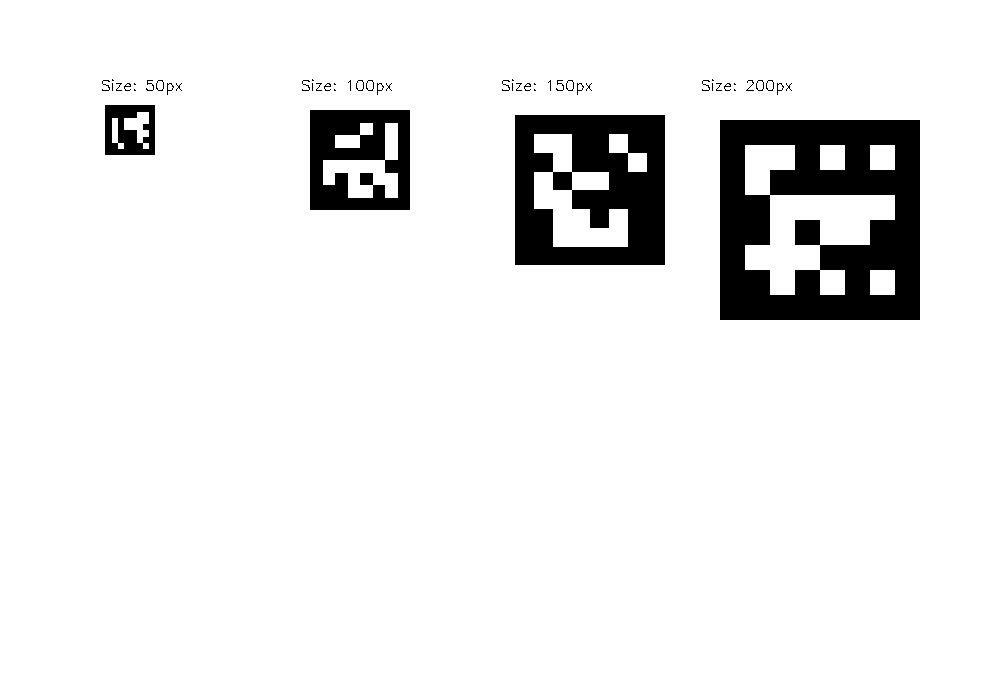

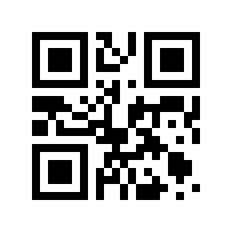


### Étape 2 : Test de détection basique des QR codes

Pour découvrir la détection de QR codes, lancez :

```powershell
python qr_tracker_basic.py
```

Ce programme active votre webcam et détecte en temps réel tous les QR codes visibles. Fonctionnalités disponibles :
- Détection automatique et affichage du contenu des QR codes
- Calcul de la position centrale et de l'aire de chaque code
- Estimation basique de la distance basée sur la taille

Contrôles clavier :
- 'q' : Quitter le programme
- 's' : Sauvegarder l'image actuelle avec les annotations dans un fichier horodaté

Pour tester, placez un QR code (généré à l'étape 1 ou créé avec votre téléphone) devant la caméra. Le programme affichera le contenu décodé et les informations de position en temps réel.

Exemple de détection : 

D'abord la vidéo depuis la webcam : 


Puis les sauvegardes faites pendant cette vidéo : 

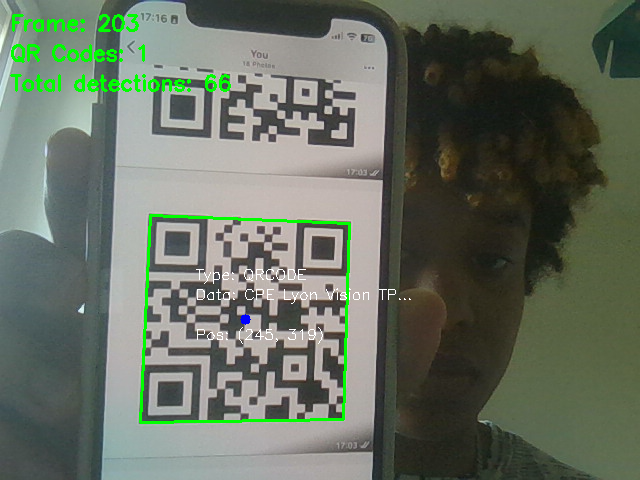

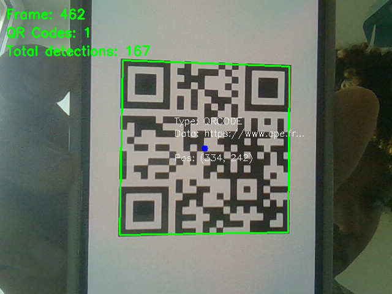

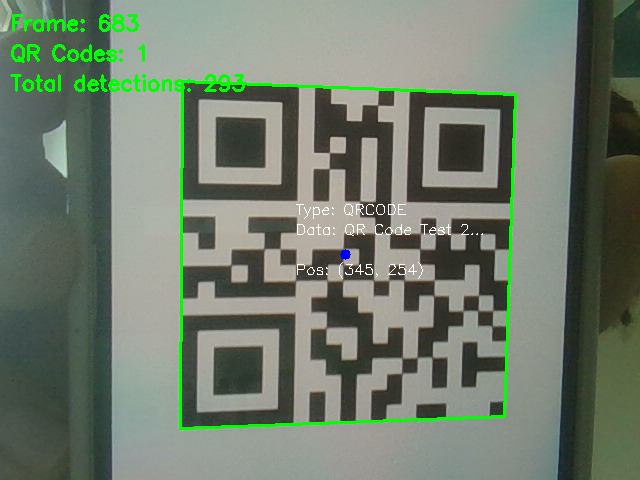

Pour une détection de plusieurs QRcode, voici le résultat : 


Tous les QRcodes sont bien détecté ainsi que leur contenu.

### Étape 3 : Test de détection avancée des marqueurs ArUco

Lancez le système de détection ArUco avec :

```powershell
python aruco_tracker_advanced.py
```

Ce programme offre des fonctionnalités avancées pour les marqueurs ArUco :
- Détection multi-marqueurs avec affichage des IDs
- Estimation de pose 3D (position et orientation dans l'espace)
- Calcul de distance géométrique précise
- Affichage des axes de référence X, Y, Z de chaque marqueur

Contrôles clavier :
- 'q' : Quitter le programme
- 's' : Sauvegarder l'image avec annotations
- 'p' : Activer/désactiver l'affichage des axes de pose
- 'i' : Afficher/masquer les informations détaillées

Utilisez les marqueurs ArUco générés à l'étape 1. Le programme affiche l'ID de chaque marqueur détecté et peut estimer sa distance réelle en utilisant sa taille connue.

Exemple de détections : 

D'abord la vidéo depuis la webcam : 


Puis les sauvegardes faîtes pendant cette vidéo : 

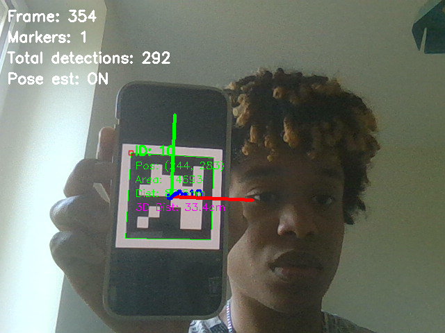

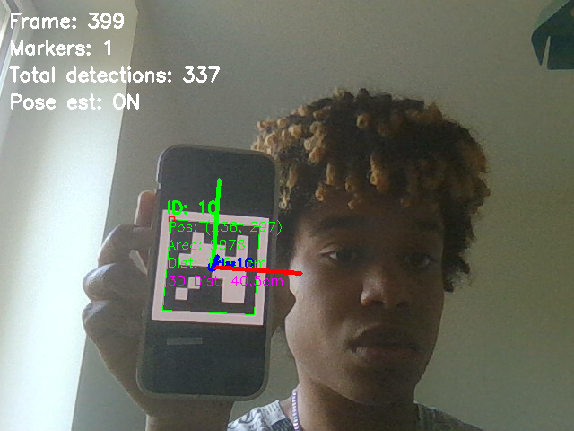

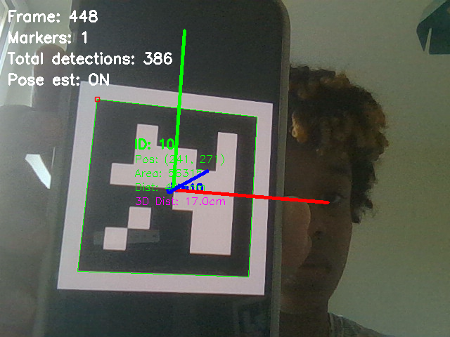

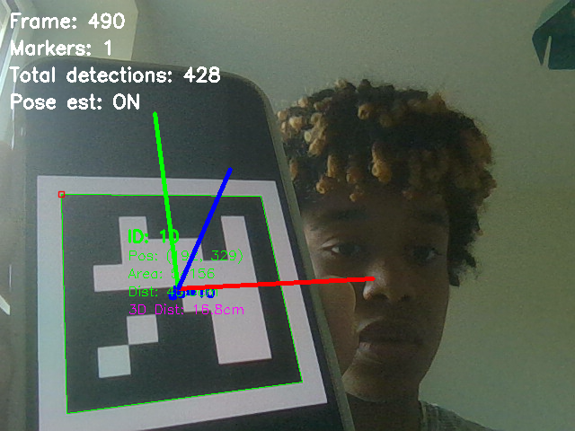

Sur ces images, l'estimation 3D fonctionne ainsi que le calcul des distances. 

Néanmoins, voyons voir ce qu'il se passe lorsqu'il y a plusieurs marqueurs de tailles différentes : 

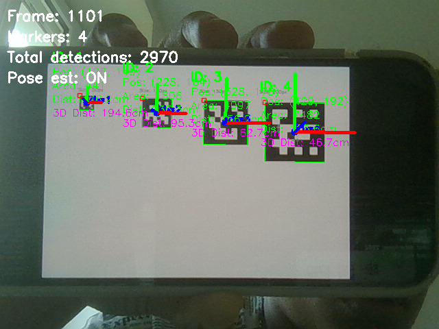

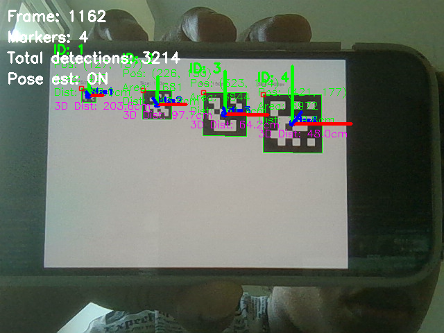

Là, c'est plus compliqué, l'évaluation de la distance ne fonctionne pas eet c'est à cause de la taille. 

Mais lorsqu'il y a un seul marqueur, l'évaluation de la distance fonctionne parfaitement donc je suis assez satisfaite. 

### Étape 4 : Système unifié multi-tags

Pour l'expérience complète avec détection simultanée, exécutez :

```powershell
python multi_tag_tracker.py
```

Ce programme combine la détection de QR codes et de marqueurs ArUco avec trois modes de suivi :

Mode 1 - Suivi du plus grand tag :
- Sélectionne automatiquement le tag avec la plus grande aire visible
- Similaire au suivi de la plus grande balle de ping-pong
- Affiche les informations détaillées du tag sélectionné

Mode 2 - Suivi par continuité spatiale :
- Maintient le suivi du même tag en privilégiant celui le plus proche de la position précédente
- Évite les changements intempestifs de cible lors de mouvements
- Idéal pour suivre un tag spécifique en mouvement

Mode 3 - Suivi multi-tags :
- Affiche simultanément tous les tags détectés (QR codes et ArUco)
- Chaque tag est annoté avec ses informations spécifiques
- Permet une surveillance globale de l'environnement

Contrôles clavier :
- 'q' : Quitter le programme
- 's' : Sauvegarder l'image actuelle
- '1' : Passer en mode "Plus grand tag"
- '2' : Passer en mode "Continuité spatiale"
- '3' : Passer en mode "Multi-tags"
- 'r' : Réinitialiser le suivi (utile en mode continuité spatiale)

Voici quelques exemples lors de l'utilisation (je n'ai pas fait de vidéo car la luminosité est assez basse mais les photos sont des sauvegardes):

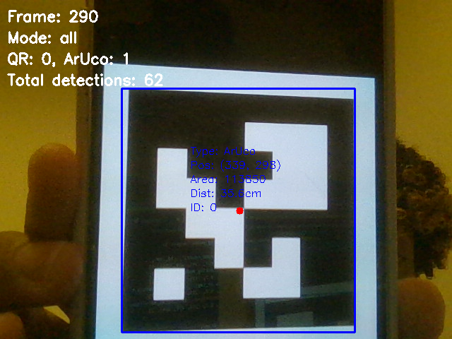

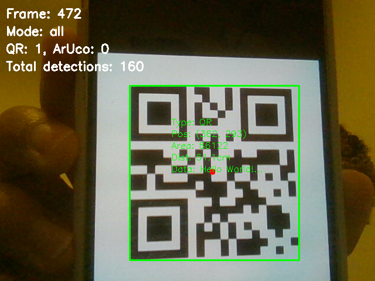

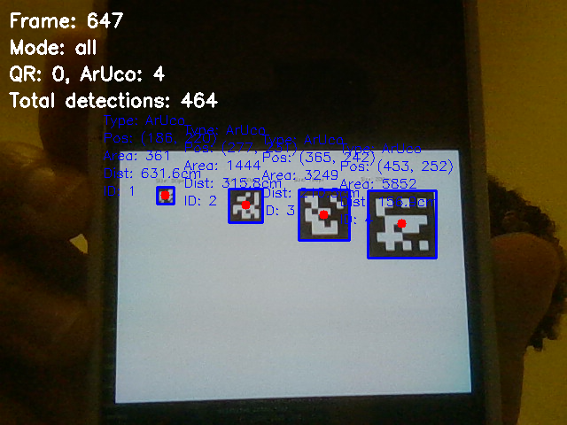

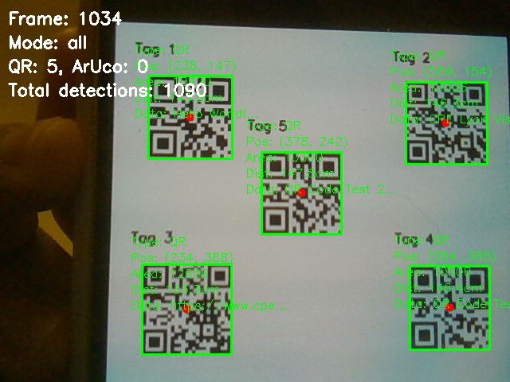

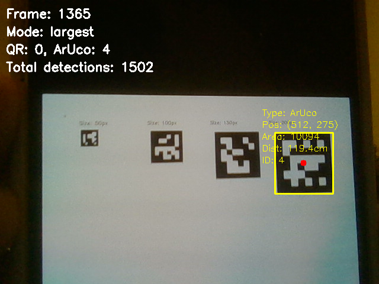

Toutess les fonctionnalités implémetées fonctionnent.

### Étape 5 : Calibration de l'estimation de distance

Pour calibrer précisément l'estimation de distance, utilisez :

```powershell
python tag_distance_estimation.py
```

Ce programme propose une procédure de calibration interactive :

1. **Phase de calibration** :
   - Placez un tag à une distance mesurée (utilisez un mètre)
   - Saisissez la distance réelle dans le terminal
   - Appuyez sur 'c' pour capturer la mesure
   - Répétez avec au moins 5-10 distances différentes (de 20cm à 2m)
   - Appuyez sur 'f' pour finaliser la calibration

2. **Visualisation des résultats** :
   - Le programme affiche la courbe de calibration
   - Montre l'équation mathématique trouvée : distance = a/√(aire) + b
   - Indique la qualité de l'ajustement (coefficient R²)

3. **Test en temps réel** :
   - Une fois calibré, le programme estime automatiquement la distance des tags détectés
   - Compare l'estimation avec les mesures réelles pour valider la précision

Contrôles clavier :
- 'q' : Quitter le programme
- 'c' : Capturer une mesure de calibration
- 'f' : Finaliser la calibration et passer en mode test
- 'r' : Recommencer la calibration
- 's' : Sauvegarder les données de calibration

Ce programme a pour but d'aider à bien calibrer l'estimation de distance.


## Comparaison avec la détection par couleur

La détection par couleur, utilisée pour le suivi de balles, présente une sensibilité importante aux variations d'éclairage et aux objets de couleurs similaires présents dans l'environnement. La précision de localisation dépend fortement de la qualité de la segmentation couleur, et les informations obtenues se limitent à la position et à la taille de l'objet détecté.

En contraste, les tags visuels offrent une robustesse remarquable aux variations d'éclairage grâce à leurs contours géométriques bien définis. La précision de localisation est supérieure en raison des bords francs et des formes régulières des tags. Au-delà de la position et de la taille, les tags fournissent des informations riches : orientation 3D, identifiants uniques, et données encodées.

La complexité algorithmique diffère également : le suivi par couleur repose sur un simple seuillage HSV, tandis que la détection de tags nécessite des algorithmes spécialisés plus sophistiqués. Cependant, les bibliothèques optimisées permettent de maintenir des performances temps réel acceptables. La scalabilité constitue un avantage majeur des tags visuels, qui peuvent gérer des milliers d'identifiants différents, contrairement au suivi par couleur limité par le nombre de couleurs distinctes utilisables.

## Fonctionnalités et algorithmes implémentés

### Détection multi-tags

Le système intègre deux moteurs de détection fonctionnant en parallèle. La détection des QR codes utilise la bibliothèque pyzbar qui analyse l'image en niveaux de gris pour identifier les motifs caractéristiques des codes QR. La détection ArUco s'appuie sur les algorithmes d'OpenCV qui recherchent les marqueurs selon un dictionnaire prédéfini.

Cette approche duale permet de tirer parti des avantages spécifiques de chaque type de tag : les QR codes pour leur capacité de stockage d'informations et leur robustesse aux déformations, les marqueurs ArUco pour leur détection rapide et leur précision géométrique.

### Stratégies de suivi adaptées

Le suivi du plus grand tag reproduit la logique du suivi de balle en sélectionnant automatiquement le tag avec la plus grande aire apparente. Cette approche fonctionne bien lorsque la taille du tag est corrélée à son importance ou à sa proximité.

Le suivi par continuité spatiale maintient le focus sur un tag spécifique en calculant les distances entre les positions des tags détectés et la position précédemment suivie. Cette méthode évite les changements intempestifs de cible et assure un suivi stable même en présence de multiples tags.

Le mode multi-tags affiche simultanément tous les tags détectés avec leurs informations spécifiques, permettant une surveillance globale de l'environnement. Chaque tag est annoté avec ses données propres : contenu décodé pour les QR codes, ID et pose pour les marqueurs ArUco.

### Estimation de distance

Le système implémente deux méthodes d'estimation de distance adaptées aux caractéristiques de chaque type de tag. La méthode empirique établit une relation mathématique entre l'aire apparente du tag et sa distance réelle selon l'équation distance = a/√(aire) + b. Les paramètres sont déterminés par calibration préalable sur des mesures connues.

Pour les marqueurs ArUco, une méthode géométrique exploite l'estimation de pose 3D fournie par OpenCV. Cette approche utilise la taille connue du marqueur et sa déformation perspective pour calculer directement la distance, offrant une précision supérieure à la méthode empirique.

## Avantages des tags visuels

### Robustesse et fiabilité

Les tags visuels présentent une invariance remarquable aux conditions d'éclairage grâce à leurs contours géométriques bien définis et leurs motifs contrastés. Contrairement aux objets colorés qui peuvent apparaître différemment sous divers éclairages, les tags maintiennent leurs caractéristiques distinctives dans une large gamme de conditions.

La résistance aux occlusions partielles constitue un autre avantage significatif. Les QR codes intègrent des codes correcteurs d'erreurs permettant la récupération des données même avec une partie du code masquée. Les marqueurs ArUco, bien que plus sensibles aux occlusions, restent détectables tant que leurs coins restent visibles.

La stabilité temporelle des tags évite les problèmes de dérive rencontrés avec la détection par couleur. Les objets colorés peuvent changer d'apparence avec l'usure, les reflets ou les changements d'éclairage, tandis que les tags imprimés conservent leurs propriétés dans le temps.

### Richesse informationnelle

Chaque tag peut porter un identifiant unique ou des données spécifiques, permettant de distinguer et de traiter différemment chaque élément détecté. Cette capacité d'identification ouvre de nombreuses possibilités pour les applications robotiques et de réalité augmentée.

L'estimation de pose complète, incluant la position et l'orientation tridimensionnelles, fournit des informations beaucoup plus riches que la simple position 2D obtenue avec la détection par couleur. Cette information est cruciale pour les applications nécessitant une localisation précise dans l'espace.

Les métadonnées encodées dans les QR codes permettent d'associer des informations complexes à chaque tag : instructions de navigation, paramètres de configuration, liens vers des ressources externes, ou toute autre donnée structurée.

## Conclusion et perspectives

### Bilan du projet

Ce projet démontre que la détection de tags visuels constitue une alternative supérieure au suivi par couleur pour de nombreuses applications de vision par ordinateur. La robustesse aux conditions d'éclairage, la précision de localisation et la richesse des informations obtenues surpassent nettement les capacités des méthodes traditionnelles.

Le système développé égale ou dépasse les performances du suivi de balles tout en apportant des fonctionnalités supplémentaires. La détection est plus fiable avec moins de faux positifs, la localisation est plus précise grâce aux contours nets, et les informations enrichies ouvrent de nouvelles possibilités d'application.

### Applications pratiques

Les tags visuels trouvent des applications naturelles dans la navigation robotique, où ils servent de repères fiables pour la localisation et la cartographie. En réalité augmentée, ils fournissent des points d'ancrage précis pour l'affichage d'objets virtuels dans l'environnement réel.

L'inventaire automatisé bénéficie de la capacité d'identification unique des tags, permettant le suivi et la localisation automatiques d'objets dans des entrepôts ou des chaînes de production. Le contrôle qualité industriel peut exploiter la précision géométrique pour vérifier le positionnement d'éléments assemblés.

### Limitations et améliorations futures

Les principales limitations actuelles concernent la nécessité de placer physiquement des tags dans l'environnement, ce qui n'est pas toujours possible ou souhaitable. Le système reste sensible aux déformations extrêmes et aux surfaces très réfléchissantes qui peuvent perturber la détection.

Les améliorations futures pourraient inclure le support de tags courbes ou placés sur des surfaces non planes, la détection multi-échelle pour gérer une plus large gamme de tailles, et la fusion avec d'autres modalités sensorielles comme la couleur ou la texture pour augmenter la robustesse.

L'optimisation GPU pourrait permettre le traitement temps réel d'images haute résolution, étendant les applications à la surveillance de grands espaces ou à la détection de tags très distants. L'intégration d'intelligence artificielle pourrait améliorer la détection dans des conditions difficiles et permettre l'adaptation automatique aux nouvelles conditions d'usage.
