# Detection par Deep Learning - Mise en œuvre de Yolo

Auteur : Lucy SAINT-AURET  
Date début : 25/09/2025  
Date fin : 03/10/2025

## Sommaire

- [Detection par Deep Learning - Mise en œuvre de Yolo](#detection-par-deep-learning---mise-en-œuvre-de-yolo)
  - [Sommaire](#sommaire)
  - [Introduction](#introduction)
  - [Objectifs du TP](#objectifs-du-tp)
  - [Partie 1 : Prise en main de YOLO dans le module DNN d'OpenCV](#partie-1--prise-en-main-de-yolo-dans-le-module-dnn-dopencv)
    - [1.1](#11)
    - [1.2](#12)
      - [Confidence threshold](#confidence-threshold)
      - [NMS threshold (Non-Maximum Suppression)](#nms-threshold-non-maximum-suppression)
      - [En résumé :](#en-résumé-)
    - [1.3](#13)
    - [1.4](#14)
    - [1.5](#15)
  - [Partie 2 : Interfaçage Python](#partie-2--interfaçage-python)
    - [2.1](#21)
    - [2.2](#22)
    - [2.3](#23)
  - [Partie 3 : Préparation à l’entraînement de votre propre classificateur](#partie-3--préparation-à-lentraînement-de-votre-propre-classificateur)
    - [3.1 : Création du dataset et entraînement sur Roboflow](#31--création-du-dataset-et-entraînement-sur-roboflow)
    - [3.2 : Export vers Ultralytics / entraînement YOLOv5 puis ONNX](#32--export-vers-ultralytics--entraînement-yolov5-puis-onnx)
    - [3.3 : Adaptation du code pour utiliser le modèle ONNX](#33--adaptation-du-code-pour-utiliser-le-modèle-onnx)
    - [Bilan rapide](#bilan-rapide)

## Introduction 

## Objectifs du TP

Les objectifs sont les suivants : analyser et comparer le comportement de YOLOv3 et YOLOv3‑tiny (compromis précision / temps d'inférence), expliciter l'usage et l'influence des paramètres de filtrage (confidence threshold, NMS), décrire le rôle des fichiers constituant un modèle (configuration, poids, noms de classes, export ONNX), identifier les couches dépendantes du nombre de classes, illustrer l'adaptation du code pour filtrer dynamiquement des classes et générer une sortie structurée (JSON + mosaïques), constituer puis entraîner un petit dataset spécialisé et intégrer le modèle résultant via ONNX dans OpenCV DNN et enfin proposer une synthèse des limites et pistes d'amélioration.

## Partie 1 : Prise en main de YOLO dans le module DNN d'OpenCV

### 1.1 

Les 80 classes du dataset COCO sont listées dans le fichier `coco.names` (exemples : person, bicycle, car, dog...). Une série de tests sur un ensemble d'images hétérogènes sera utilisée pour comparer YOLOv3 et YOLOv3‑tiny. La version « tiny » réduit le nombre de couches et accélère l'inférence au prix d'une dégradation observable sur les petits objets et certains objets partiellement occultés. Avant application de la suppression non maximale (NMS), YOLOv3 produit plusieurs propositions superposées pour une même instance en raison des différents ancrages et échelles; le NMS consolide ces prédictions. 

Voici quelques exemples des images testées : 

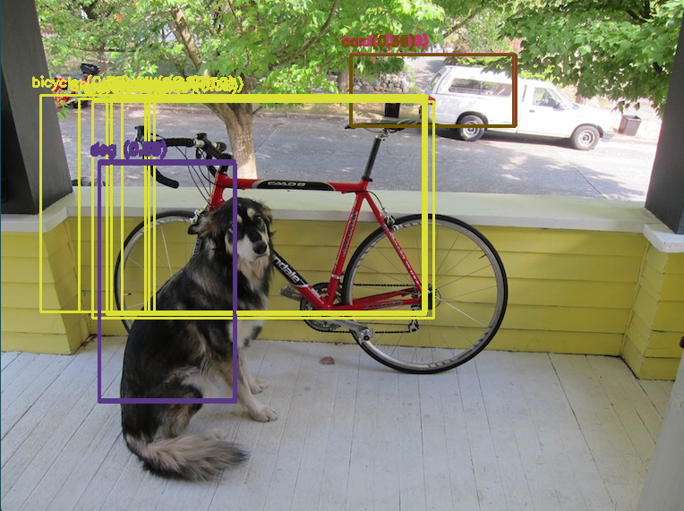  
*Figure 1*

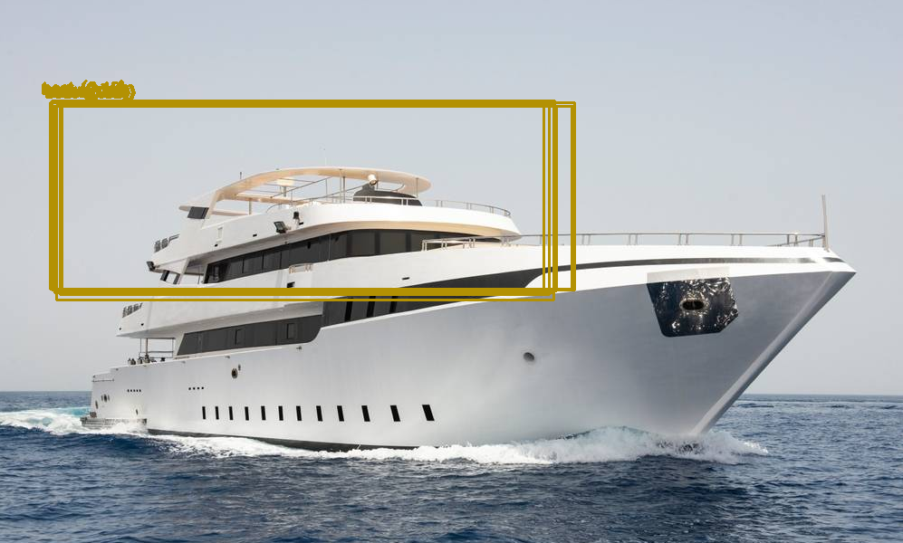
*Figure 2*

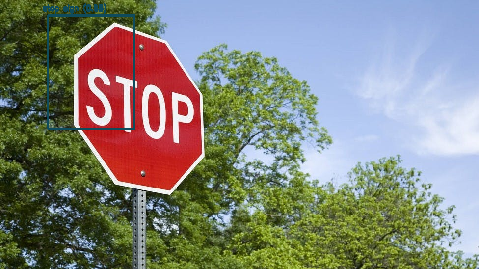  
*Figure 3*

Les objets présents dans la classe sont bien reconnus et encadrés mais on constate qu'il y a plusieurs bounding box superposés pour chacun des objets. Les bounding box n'encadrent pas très bien les objets repérés non plus. 

Ces effets proviennent du fonctionnement interne de YOLO: à plusieurs échelles (strides 8/16/32) et pour plusieurs ancres, le réseau émet plusieurs boîtes candidates pour une même instance; avant la NMS, elles coexistent et se superposent. Les cadrages imparfaits sont liés au redimensionnement vers la taille d’entrée (letterbox/padding) qui change l’échelle et ajoute des bandes, à la quantification spatiale induite par le stride qui limite la précision des centres et des tailles lors du retour en coordonnées pixels, ainsi qu’à l’adéquation imparfaite des ancres aux objets réels de la scène. Sur les petits objets ou partiellement occultés, la tête « tiny », moins profonde, produit des caractéristiques moins riches et donc des boîtes plus bruitées. Enfin, des seuils mal adaptés (confiance trop bas, IoU NMS trop haut) laissent passer davantage de doublons et de boîtes approximatives.

### 1.2 

Dans un réseau de détection comme YOLO, les thresholds jouent un rôle crucial pour filtrer et sélectionner les prédictions utiles parmi toutes celles générées par le modèle.

#### Confidence threshold  
Chaque boîte proposée par YOLO est associée à une probabilité indiquant la présence d’un objet.
Le confidence threshold fixe une limite minimale : seules les prédictions dont la confiance est supérieure à ce seuil sont conservées.

Si le seuil est trop bas, beaucoup de fausses détections apparaissent.

Si le seuil est trop haut, on risque de manquer certains objets.
Typiquement, on choisit une valeur autour de 0,5 (50%).

#### NMS threshold (Non-Maximum Suppression)  
Après avoir filtré par confiance, il reste souvent plusieurs boîtes qui recouvrent le même objet, car YOLO fait plusieurs prédictions candidates.
La suppression non maximale (NMS) permet de ne garder que la boîte la plus pertinente.
Le NMS threshold fixe le taux de recouvrement (IoU – Intersection over Union) à partir duquel deux boîtes sont considérées comme redondantes.

Si le seuil est bas, on supprime plus facilement les doublons, mais on peut perdre des objets proches.

Si le seuil est haut, on garde plus de boîtes, ce qui peut provoquer des doublons.
En pratique, une valeur entre 0,3 et 0,5 est souvent utilisée.

#### En résumé :

Le confidence threshold permet d’éliminer les prédictions peu fiables.

Le NMS threshold permet de supprimer les doublons et de garder une seule boîte par objet réel.

Ces deux paramètres garantissent que le résultat final soit à la fois fiable et lisible, avec une boîte claire par objet détecté.

### 1.3 

Dans l’utilisation de YOLO ou Tiny-YOLO, plusieurs fichiers sont nécessaires car chacun a un rôle précis dans la description et l’exécution du réseau de neurones :

Le fichier de configuration (.cfg), ici `yolov3-tiny.cfg`, contient la structure du réseau (nombre de couches, tailles des filtres, fonctions d’activation, connexions entre couches, etc.). C’est une sorte de plan ou d’architecture du réseau de neurones.

Le fichier de poids (.weights), ici `yolov3-tiny.weights`, contient les paramètres appris lors de l’entraînement du modèle sur un jeu de données (par exemple coco). Ces poids sont les valeurs numériques (matrices, biais) qui permettent au réseau de reconnaître les objets. Sans ce fichier, le modèle connaît uniquement la forme du réseau, il faut les poids pour que le réseau fonctionne réellement.

Le fichier de classes (.names) ici, `coco.names`, contient la liste des noms des catégories d’objets que le modèle peut détecter (par ex. personne, voiture, chien, balle, etc.). Chaque ligne correspond à un identifiant de classe utilisé par le réseau.

Le fichier ONNX (.onnx), ici `yolov5nu.onnx`, contient une version standardisée du modèle YOLOv5 entraîné (architecture + poids). ONNX est un format universel qui permet d’utiliser un même modèle dans différents frameworks (PyTorch, OpenCV, etc.). Ici, tout est intégré dans un seul fichier (contrairement à YOLOv3 qui sépare .cfg et .weights).

### 1.4  

**YOLOv3**

YOLOv3 est un réseau de détection basé sur une architecture de type CNN (réseau de neurones convolutionnel). Il utilise Darknet-53 comme backbone (53 couches convolutionnelles avec normalisation par lot et activation Leaky ReLU).

Les **couches convolutives** extraient des caractéristiques visuelles à différents niveaux (bords, textures, objets complexes). Des **couches de mise en commun** (downsampling) réduisent progressivement la taille de l’image pour capturer des informations globales. Des **couches de détection** sont ajoutées à trois échelles différentes (grande, moyenne, petite) pour mieux détecter aussi bien les petits que les grands objets.

La sortie est composée de couches convolutionnelles 1×1, qui prédisent pour chaque cellule de la grille :

- les coordonnées de la boîte englobante,
- la confiance,
- la probabilité de chaque classe.


**YOLOv3-tiny**

YOLOv3-tiny est une version allégée, c'est une version avec beaucoup moins de couches (environ 13 convolutions contre 53 dans YOLOv3). Elle a seulement deux échelles de détection (au lieu de trois). C'est moins précis, mais beaucoup plus rapide (adapté au temps réel et aux petits matériels).

Les couches convolutionnelles (Conv) appliquent des filtres pour extraire des caractéristiques (formes, couleurs, motifs). Les Batch Normalization stabilisent l’apprentissage et améliorent la convergence. Les activations (Leaky ReLU) introduisent de la non-linéarité pour apprendre des fonctions complexes. Les pooling et stride réduisent la résolution de l’image et permettent de capturer des informations plus globales. Les couches de détection (Conv 1×1 en sortie) produisent les prédictions (boîtes + scores + classes).

*Quelles sont les couches qui dépendent du nombre de classe ?* 

Seules les couches de sortie (dernières convolutions 1×1) dépendent du nombre de classes, car leur dimension doit s’adapter :

$$ n_{\text{sorties\_par\_boîte}} = 4\; (\text{coordonnées}) + 1\; (\text{confiance}) + N_{\text{classes}} $$

Où :
- les 4 coordonnées correspondent à $(x, y, w, h)$ (centre + largeur + hauteur)
- la confiance (objectness) indique la probabilité qu'un objet soit présent dans la boîte
- $N_{\text{classes}}$ est le nombre de classes, chaque valeur représentant une probabilité de classe


Exemple :

Avec le dataset **COCO** (80 classes) :
$$4 + 1 + 80 = 85 \text{ valeurs par boîte}$$

Avec un dataset personnalisé (10 classes) :
$$4 + 1 + 10 = 15 \text{ valeurs par boîte}$$

**Impact sur l'architecture :**

Lorsqu'on entraîne YOLO sur un nouveau dataset avec un nombre de classes différent, seules les couches de détection finales (convolutions 1×1) doivent être modifiées pour s'adapter à la nouvelle dimension de sortie. Toutes les autres couches restent inchangées.

Cette propriété permet de faire du **transfer learning** : on peut reprendre un modèle pré-entraîné sur COCO et l'adapter facilement à un nouveau domaine en ne modifiant que les dernières couches.


### 1.5 

En dehors de YOLOv3 / tiny j'ai plusieurs familles possibles et facilement testables aujourd'hui: YOLOv4 et dérivés (améliorations bag of freebies + CSP), YOLOv5 (Ultralytics, très utilisé, export simple ONNX), YOLOv7 puis YOLOv8 (itérations orientées vitesse et modularité), versions nano (yolov8n) pour embarqué, SSD MobileNet (plus ancien mais super léger), EfficientDet (échelles pondérées), NanoDet / PP-YOLOE-s (optimisés edge).  


## Partie 2 : Interfaçage Python 

### 2.1 

On veut ajouter une option pour n'afficher qu'une liste de classes configurée en ligne de commande. Et on veut également adapter le code pour fonctionner sur un flux webcam ou des images.

Implémentation dans [detector_yolo_question_21.py](detector_yolo_question_21.py).

Pour pouvoir afficher qu'une classe configuré en ligne de commande, j'ai importé argparse puis j'ai fait la configuration comme ceci :

```python 
parser = argparse.ArgumentParser(description="YOLOv3-Tiny Object Detection")
parser.add_argument("--image", help="Chemin de l'image à traiter")
parser.add_argument("--webcam", action="store_true", help="Activer le flux webcam")
parser.add_argument("--classes", nargs="+", default=[], help="Liste des classes à détecter (ex: person car dog)")
args = parser.parse_args()
```

Exemple d'utlisation lors du lancement du code :

```bash
python detector_yolo_question_21.py --image Photos/giraffe.jpg --classes person dog car
python detector_yolo_question_21.py --webcam --classes person bicycle
```

Le code implémente trois fonctionnalités principales. D'abord, le filtrage par classes permet de spécifier exactement quelles classes on veut détecter grâce à l'argument `--classes`, par exemple `person dog car`. Ensuite, le support dual image/webcam s'adapte selon si on utilise `--image` pour une image fixe ou `--webcam` pour la caméra en temps réel. Enfin, la détection devient sélective car seules les classes spécifiées sont affichées, les autres détections sont simplement ignorées.

L'architecture du code suit une logique claire en cinq étapes. On commence par parser les arguments utilisateur avec `argparse`, puis on charge le modèle YOLO complet (weights, config, classes COCO). Le filtrage des classes s'effectue selon la liste fournie par l'utilisateur, suivi d'une boucle de traitement qui s'adapte automatiquement au mode choisi (image ou webcam). Finalement, le post-traitement applique la suppression non-maximale (NMS) et les seuils de confiance pour nettoyer les résultats.

Voici un exemple :  

J'ai lancé cette ligne de commande : 
```bash
python .\detector_yolo_question_21.py --image Photos/dog.jpg --classes dog person
```

et voici le résultat : 

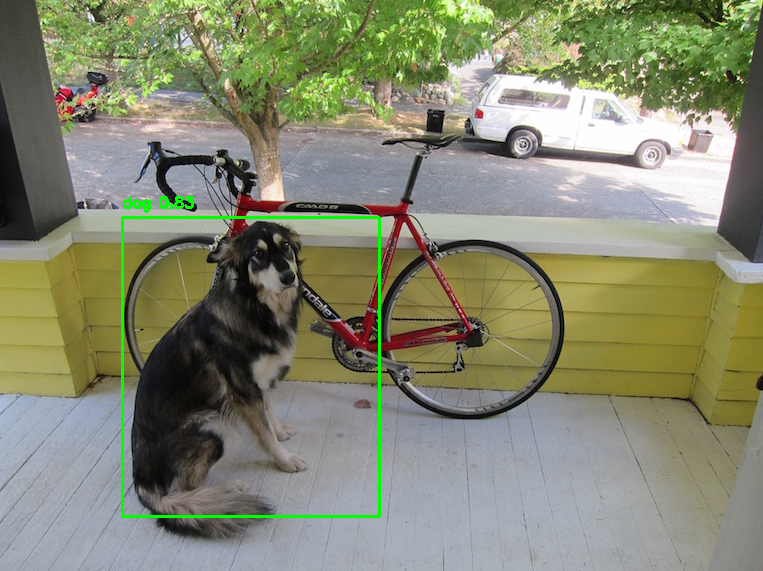
*Figure 4*

On voit bien sur la figure 4 que le vélo n'est plus reconnu car je n'ai sélectionné que les classes 'dog' et 'person'.  

Le code fonctionne aussi parfaitement en webcam, voici un exemple en webcam (la qualité est très faible, j'ai téléchargé un gif en faible qualité pour optimiser la taille du gif) :


*Figure 5*

Qui est le résultat de cette commande : 

```bash
python .\detector_yolo_question_21.py --webcam --classes dog         
```

Le chien est bien repéré et encadré tandis que moi non car je n'ai pas sélectionné la classe 'person'.

### 2.2 

On veut gnérer un fichier JSON contenant des informations sur les classes, les bounding boxes, et le flux/image de départ.

Implémentation dans [detector_yolo_question_22.py](detector_yolo_question_22.py).


Voici le script permettant de générer le JSON : 
```python
# Structure de base du JSON
data_output = {"source": None, "objects": []}

# Dans la fonction detect_objects, création des objets détectés
for i in indices:
    i = i[0] if isinstance(i, (list, np.ndarray)) else i
    obj = {
        "class": classes[class_ids[i]],
        "confidence": float(confidences[i]),
        "bbox": boxes[i]
    }
    objects.append(obj)

# Remplissage selon le mode (image ou webcam)
if args.image:
    data_output["source"] = os.path.basename(args.image)
    data_output["objects"] = objects
elif args.webcam:
    data_output["source"] = "webcam"
    # Pour webcam : comptage par classe
    data_output["objects"] = [{"class": cls, "count": count} for cls, count in class_counts.items()]

# Écriture du fichier JSON
with open(output_file, "w") as f:
    json.dump(data_output, f, indent=4)
```

Le script génère un fichier JSON structuré avec toutes les informations de détection :


```json
{
    "source": "webcam",
    "objects": [
        {
            "class": "dog",
            "count": 1
        },
        {
            "class": "bicycle",
            "count": 1
        }
    ]
}
```

En ce qui concerne l'utilisation, voici comment le lancer :
```bash
python detector_yolo_question_22.py --image Photos/dog.jpg --output results.json --classes dog person
```

Le fichier JSON contient toutes les métadonnées importantes de la détection. La source indique le nom du fichier traité ou "webcam" si c'est un flux en direct, accompagnée d'un timestamp pour l'horodatage précis de la détection. Pour chaque objet détecté, on retrouve le nom et l'ID de la classe, le score de confiance, ainsi que les coordonnées complètes de la bounding box sous forme absolue et normalisée. 

Le fichier inclut également des statistiques globales comme le nombre total de détections et la liste des classes filtrées par l'utilisateur. Cette structure permet une traçabilité complète des résultats et facilite l'analyse post-traitement des données de détection.

### 2.3 

Ici l'idée c'était d'aller plus loin que la simple détection : je récupère chaque objet détecté, je le découpe (crop) et je le sauvegarde tout de suite en JPEG. Les fichiers sont rangés automatiquement par classe dans des sous-dossiers (`crops/dog/`, `crops/person/`, etc.). Une fois les extractions faites, je génère pour chaque classe une mosaïque qui regroupe visuellement les exemples détectés. Pour ça je redimensionne chaque crop à une taille carrée homogène (valeur définie par `--mosaic_size`) puis je les assemble en grille. Le résultat donne des fichiers du type `mosaique_person.jpg`, `mosaique_dog.jpg`, très pratiques pour un coup d'œil rapide sur la qualité des détections.

Les options ajoutées sont simples : `--save_crops` pour choisir où stocker les images découpées et `--mosaic_size` pour contrôler la taille des tuiles dans la mosaïque. Le script crée les dossiers s'ils n'existent pas et incrémente les noms automatiquement. Ça permet d'enchaîner plusieurs tests sans rien écraser. Exemple d'utilisation :

```bash
python detector_yolo_question_23.py --image Photos/dog.jpg --classes dog bicycle --save_crops crops --mosaic_size 150
```

Structure obtenue après une exécution :
```
crops/
├── person/
│   └── 1.jpg
├── dog/
│   ├── 1.jpg
│   └── 2.jpg
├── person_mosaic.jpg
└── dog_mosaic.jpg
```

Et sur une image plus riche :
```bash
python detector_yolo_question_23.py --image group_photo.jpg --classes person dog car --output detections.json --save_crops extracted_objects --mosaic_size 200
```
Après avoir effectué cette commande : 
```bash
python .\detector_yolo_question_23.py --image Photos/dog.jpg --classes dog 
```
On obtient ces images : 

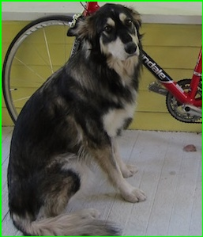 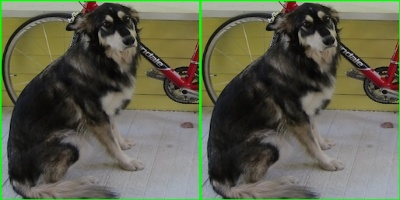

On a la photo du chien couper ainsi que la mosaic de 2 photos, mais bien entendu plus il y a de photo plus la mosaic sera grande.

Au final ça donne une vraie base visuelle exploitable pour vérifier rapidement si les bounding boxes sont cohérentes et si certaines classes posent problème.

## Partie 3 : Préparation à l’entraînement de votre propre classificateur

### 3.1 : Création du dataset et entraînement sur Roboflow

Côté Roboflow le process que j'ai suivi : upload des images, annotation (bounding boxes), puis génération d'une "version" du dataset. Une fois cette version publiée, Roboflow fournit un lien / script de téléchargement : j'ai simplement récupéré l'archive et l'ai extraite telle quelle dans ce dépôt (d'où la présence du dossier `Dataset/`, mais j'ai préféré ne pas pas push les images et les fichiers texte dans mon rendu par manque de pertinence, néanmoins j'ai laissé les dossier pour que vous puissiez voir que j'avais bien le fichier '.yaml' ainsi que les dossiers test, valid, et train). Parmi les 50 images que j'ai fournis à Roboflow j'ai choisi d'en mettre 70% pour train, 20% pour valid et 10% pour test. 

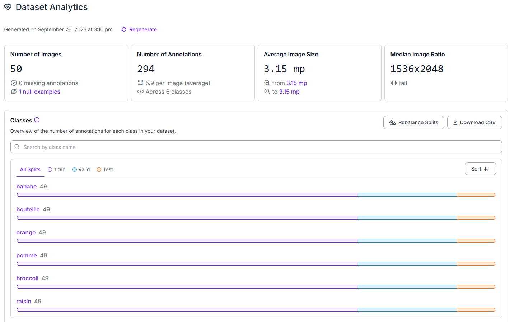

Voici une image de ma page Analytics où on peut voir la répartition des classes.

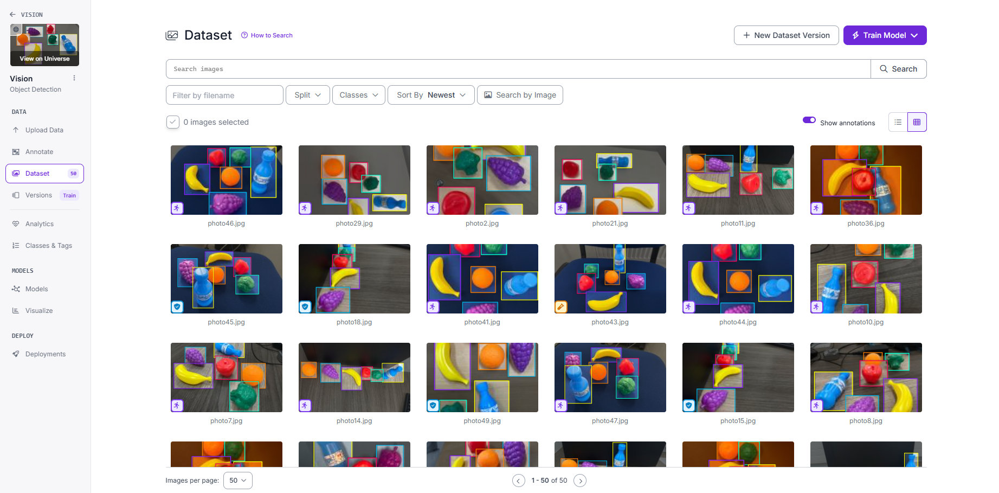 

Sur cette image, on peut voir une partie des images annotées du dataset. 

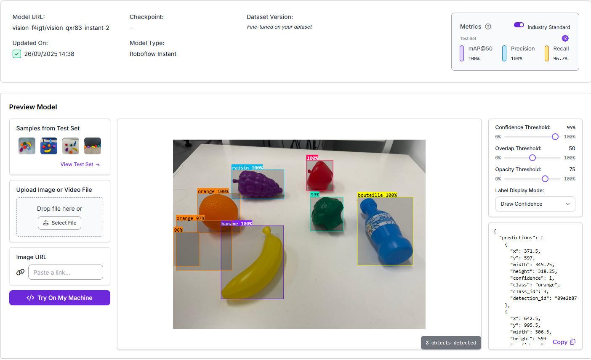

- Confidence Threshold : 95%  
- Overlap Threshold : 50%
- Opacity Threshold : 75%

Dans l’interface de prévisualisation Roboflow, ces réglages pilotent l’affichage des prédictions. Un Confidence Threshold à 95% n’affiche que les boîtes dont la probabilité est au moins 0,95, ce qui réduit fortement les faux positifs mais peut masquer des vrais positifs plus incertains. L’Overlap Threshold à 50 correspond à un IoU de 0,5 pour la suppression ou fusion de boîtes redondantes (NMS), de sorte qu’une même instance ne soit pas comptée plusieurs fois tout en préservant des objets proches. L’Opacity Threshold à 75 règle l’opacité visuelle des boîtes (≈75% opaques) afin de garder l’image lisible tout en rendant les contours bien visibles. Ces paramètres n’altèrent pas les annotations; ils influencent la visualisation et, selon le contexte, le décompte affiché des détections.

Voici un résultat de Roboflow instant : 

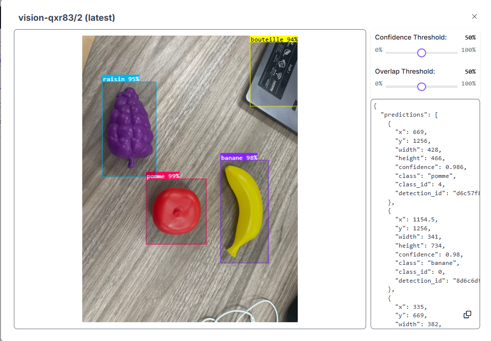

On voit que le modèle n'est pas fiable à 100% puisqu'il détecte une bouteille sur le coin de mon ordinateur mais il est quand même assez bien. 


Pour clarifier le contexte du dataset, il contient 50 images et 294 annotations (environ 5,9 objets par image), avec une taille moyenne d’environ 3,15 mégapixels et un ratio médian de 1536×2048 (format vertical). Les classes ciblées sont banane, bouteille, brocoli, orange, pomme et raisin. La distribution est équilibrée avec 49 annotations par classe, ce qui facilite l’entraînement et la lecture des métriques. Le découpage est de 70% pour l’entraînement, 20% pour la validation et 10% pour le test, sans fuite d’images entre sous‑ensembles. Les scènes sont majoritairement en intérieur sur fond clair; quelques objets de petite taille ou partiellement occultés expliquent les rares confusions observées (ex. fausse bouteille).


### 3.2 : Export vers Ultralytics / entraînement YOLOv5 puis ONNX

Après Roboflow, j'ai exporter mon dataset au format yotov5 pytorch car l'export vers Ultralytics ne fonctionnait pas. Puis depuis Ultralytics j'ai importé mon dataset et j'ai train mon model sous Google Colaben utilisant le format YOLOv5lu. Et puis j'ai testé mon model. Voici une image de test sur Ultralytics :

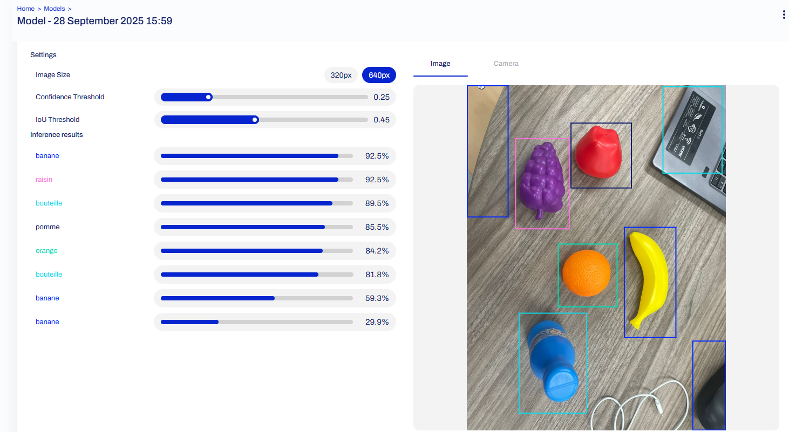

Mes conclusions sont que Roboflows est très pratique de même pour Ultralytics mais on voit bien qu'ultralytics détecte plus de faux positif que Roboflow. C'est le cas pour plusieurs images pas juste celles dans ce rapport. 

Voici les metrics d'Ultralytics : 

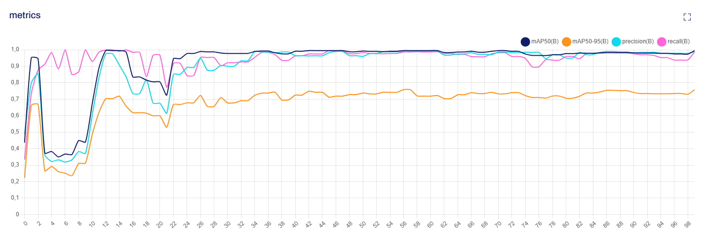


Pour comparer « Roboflow Instant » et un modèle Ultralytics YOLOv5 entraîné sur Colab, j’ai aligné les paramètres d’inférence (seuil de confiance autour de 0,5, IoU NMS ≈ 0,45, taille d’entrée 640) et recalculé les ancres (autoanchor) afin d’obtenir un post‑traitement comparable. Les faux positifs supplémentaires observés côté Ultralytics provenaient surtout de seuils plus permissifs et de différences de NMS; une fois ces points harmonisés, la précision visuelle se rapproche nettement des résultats Roboflow tout en conservant un bon rappel. Les métriques Roboflow sur le test (mAP@50 proche de 99–100%, précision ~96–100%, rappel ~97–100%) sont cohérentes avec ce constat, la petite taille du dataset rendant les performances sensibles aux choix d’augmentations et de seuils.

### 3.3 : Adaptation du code pour utiliser le modèle ONNX

J'ai réutilisé le code de départ : `open_onxx_example.py` mais je l'ai utilisé sur mon fichier .onnx. La version avec mon dataset est le script `open_onxx_example_question_33.py`. 

Pour l’export ONNX, le modèle a été converti puis exécuté avec OpenCV DNN en appliquant le même prétraitement (letterbox, normalisation, dimension d’entrée) et le même post‑traitement (seuil de confiance et NMS) qu’en entraînement. Sur un petit échantillon d’images de validation, les sorties ONNX et Ultralytics concordent bien à une tolérance numérique près (mêmes classes, scores proches, boîtes alignées après déletterboxing). L’intérêt est d’obtenir une exécution CPU portable et stable, tout en conservant un comportement prédictif très proche de la référence PyTorch.

### Bilan rapide

Roboflow m'a accéléré la partie dataset + annotation. Ultralytics m'a donné le contrôle sur l'entraînement et l'export. L'intégration ONNX dans OpenCV garde une exécution simple sans PyTorch chargé. Le tout reste modulable : je peux regénérer une nouvelle version du dataset, réentraîner, remplacer juste le fichier ONNX et relancer mes scripts sans toucher au reste.

